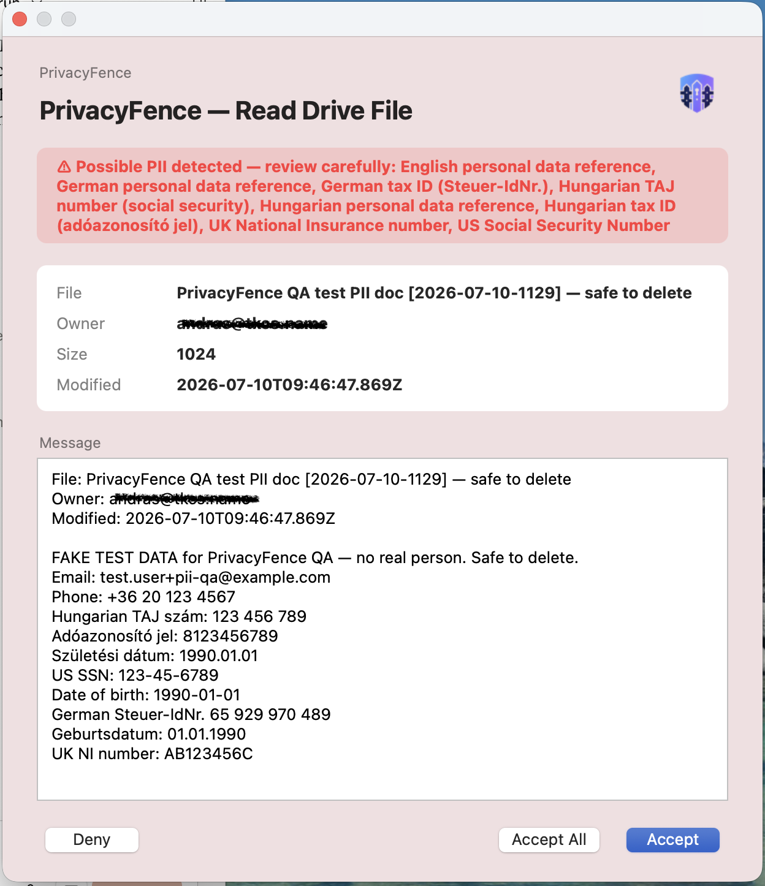
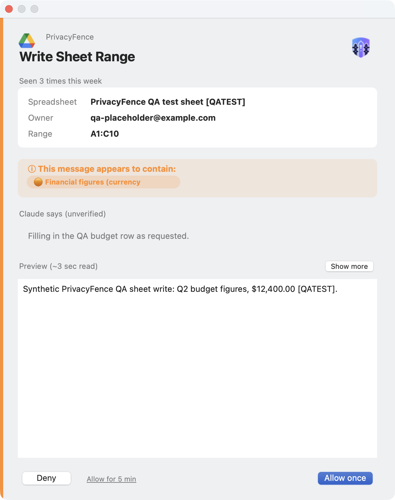
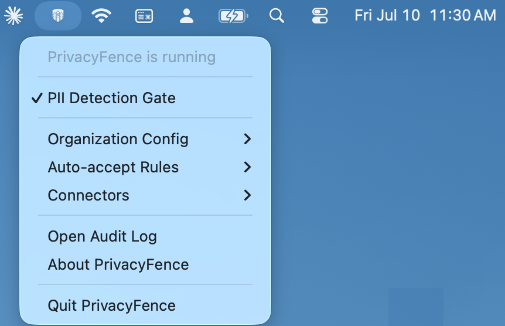

# PrivacyFence

**Human control and policy enforcement for AI access to enterprise data.**

PrivacyFence is a local enterprise AI governance layer for macOS. It sits between an MCP-compatible AI assistant and the business systems it can access, so data reads and actions are reviewed, governed, and logged before they are executed.

Instead of granting an AI assistant broad, persistent access and relying on the assistant to use it safely, PrivacyFence applies an independent control point:

- **Human approval** for sensitive reads and actions
- **Policy-based automation** for routine, low-risk requests
- **PII detection** before personal data enters the AI context
- **Audit logging** for accepted, denied, and automatically approved requests
- **Connector-level control** across common enterprise systems
- **Local credential ownership**: credentials remain in the PrivacyFence daemon, not in the AI-facing bridge

> PrivacyFence currently runs on macOS and integrates with Claude through MCP. Its governance model is designed around a broader problem: controlling how AI assistants access and act on enterprise information.

---

## Why PrivacyFence?

Organizations are rapidly adopting AI assistants, but conventional access-control models were designed for people and applications—not autonomous agents that can independently search, retrieve, combine, and modify information across multiple systems.

Granting an assistant access to Gmail, Drive, Slack, Salesforce, Jira, or other business tools can create a new gap between authorization and intent:

- A user may be authorized to access a record, but may not want that record sent to an AI.
- A connector may technically permit an action, but the action may still require human judgment.
- Static permissions cannot capture the context of a specific request.
- Native AI-client prompts may show technical tool names without enough business context.
- Broad access can reduce accountability unless every decision is traceable.

PrivacyFence introduces a governance layer between the assistant and enterprise systems. It allows AI to remain useful while keeping access decisions visible, contextual, and accountable.

---

## Governance principles

PrivacyFence is built around five principles:

1. **The AI assistant is not the authorization boundary.**  
   Policy and approval are enforced independently by PrivacyFence.

2. **Humans stay in control of sensitive data and consequential actions.**  
   Users can inspect the actual content or action before approving it.

3. **Routine work should remain efficient.**  
   Narrow auto-accept rules and temporary approvals reduce repetitive prompts without creating unrestricted access.

4. **Every decision should be auditable.**  
   Accepted, denied, and auto-accepted requests are recorded locally.

5. **Governance should enable AI adoption—not block it.**  
   The objective is safe, practical use of AI across real business workflows.

---

## What PrivacyFence governs

PrivacyFence applies policy and review to both directions of an AI workflow.

### Data flowing to the AI

Examples:

- Reading an email or email thread
- Opening a Drive file or Google Doc
- Reading spreadsheet values
- Searching Slack or Telegram
- Reading a Jira issue
- Fetching a Salesforce record or report
- Reading a Confluence page

Sensitive reads can be shown in full before release to the assistant. The optional PII detection gate scans read content locally and adds an explicit warning when likely personal data is found.

### Actions flowing from the AI

Examples:

- Creating a Gmail draft
- Sending a Slack or Telegram message
- Creating or updating calendar events
- Writing to a Drive file, Google Doc, or spreadsheet
- Creating or updating Jira issues
- Creating or updating Confluence pages
- Creating or updating contacts and tasks
- Moving or uploading files

Write dialogs explain the intended operation in business terms and require explicit approval before execution.

---

## Human-readable approvals

PrivacyFence translates MCP tool calls into operation-specific review dialogs. Users see the target object, relevant metadata, the full content or action, and the available decision—not just a raw tool name or JSON payload.

### PII-aware review



The PII gate runs locally before a read is approved. When likely personal data is detected, PrivacyFence highlights the categories found and requires an additional confirmation.

### Review before an AI action



Write operations show exactly which object will change and what values will be written. Selected high-frequency operations can receive a narrowly scoped, in-memory **Accept for 5 min** approval.

### Local administration



The menu bar provides access to:

- PII detection
- Organization configuration
- Auto-accept rules
- Connector authentication and status
- The local audit log

---

## Policy-based automation

Not every request needs a popup.

PrivacyFence can automatically approve routine, low-risk operations when a narrowly defined rule matches. Rules can use context such as:

- sender domain or Gmail label
- file ownership or approved Drive folder
- spreadsheet and tab
- Slack channel
- calendar ownership and attendee scope
- Jira project
- Confluence space
- Salesforce object type or report
- Telegram chat
- Google Tasks list

PII detection takes precedence over read auto-accept rules. A request that would normally pass silently is returned to human review when likely personal data is found in the content.

Temporary approval is also available for selected repetitive write operations. These approvals are scoped to the same operation and file, held only in memory, and expire automatically.

Scheduled Claude Cowork tasks can run unattended: a `privacyfence_check_policy` tool lets Claude
check ahead of time whether a call would auto-accept or need a human, and an opt-in unattended-session
mode denies unmatched requests immediately instead of leaving a popup open for nobody to answer. See
[Technical Reference](docs/TECHNICAL_REFERENCE.md#scheduled--unattended-cowork-tasks).

---

## Supported connectors

| Connector | Examples of governed capabilities |
|---|---|
| Gmail | Read messages and threads, download attachments, create drafts and replies, manage labels, archive messages, create and update filters |
| Google Drive & Docs | Read, download, upload, move, and write files; write, partially edit, and format (including highlight) Google Docs; add comments |
| Google Sheets | Read ranges, write and format ranges, add and rename tabs, insert and delete rows/columns |
| Google Calendar | Read event details, get/set event visibility, create and update events, create out-of-office entries, set working location |
| Google Contacts | Read, create, update, and label contacts |
| Slack | Read channels and threads, search messages, send messages |
| Salesforce | Read records, search by name or id, and run reports |
| Jira | Read, create, update, comment on, and transition issues |
| Confluence | Read, create, and update pages |
| Google Tasks | Read, create, update, complete, uncomplete, and move tasks |
| Telegram | Read chats, search messages, and send messages |

The detailed tool-by-tool privacy matrix is maintained in [Technical Reference](docs/TECHNICAL_REFERENCE.md#connectors--privacy-matrix).

---

## Architecture


PrivacyFence is split into two processes:

- **`privacyfence-bridge`** is a small, ephemeral MCP server started by the AI client. It has no service credentials and forwards requests over a local Unix socket.
- **`privacyfence-app`** is the persistent macOS daemon. It owns credentials, connector clients, policy evaluation, approval dialogs, PII detection, temporary approvals, and the audit log.

The bridge is disposable. The daemon is the authoritative security and governance boundary.

```text
AI assistant
     │
     │ MCP
     ▼
privacyfence-bridge
     │
     │ local Unix socket
     ▼
privacyfence-app
     │
     ├── policy and auto-accept rules
     ├── PII detection for reads
     ├── human review gate
     ├── temporary approvals
     ├── audit log
     └── enterprise connectors
```

See [Technical Reference](docs/TECHNICAL_REFERENCE.md) for the review model, connector matrix, rule catalogue, installation, configuration, IPC design, and MCP annotation rationale.

---

## Who is PrivacyFence for?

PrivacyFence is relevant to:

- CIOs and CTOs introducing AI assistants into business workflows
- CISOs and information-security teams
- AI governance, privacy, risk, and compliance leaders
- Enterprise IT administrators
- Developers building MCP-enabled workflows
- Organizations assessing AI use under GDPR, the EU AI Act, and internal information-handling policies

PrivacyFence is currently an open-source macOS implementation rather than a certified compliance product. It can support governance and evidence collection, but it does not by itself make an organization compliant with any regulation.

---

## Why existing approaches fall short

| Existing approach | PrivacyFence |
|---|---|
| Block AI access entirely | Enable AI through governed access |
| Trust the AI client as the final control point | Enforce policy in an independent local daemon |
| Use static, broad permissions | Evaluate each operation in context |
| Show generic technical prompts | Present business-aware previews |
| Provide limited decision history | Maintain a local audit trail |
| Reapprove every routine request | Allow narrow policy rules and expiring approvals |
| Ignore content sensitivity | Detect likely PII before read content reaches the AI |

---

## Quick start

### Install from the DMG

1. Download the latest `PrivacyFence-<version>.dmg` from [Releases](../../releases).
2. Drag **PrivacyFenceApp.app** to `/Applications`.
3. Install the organization configuration provided by your IT administrator.
4. Authenticate the connectors you want from the PrivacyFence menu bar.
5. Install **PrivacyFence.mcpb** into Claude Desktop.

> Releases are not notarized yet. Current Gatekeeper instructions and full installation details are documented in [Technical Reference](docs/TECHNICAL_REFERENCE.md#installation).

### Run from source

```bash
git clone https://github.com/andras-tkcs/privacyfence
cd privacyfence
python -m venv .venv
source .venv/bin/activate
pip install -e .
```

Continue with the organization configuration and connector authentication steps in the [Technical Reference](docs/TECHNICAL_REFERENCE.md#installation).

---

## Documentation

- [Technical Reference](docs/TECHNICAL_REFERENCE.md) — review model, connectors, policies, installation, configuration, and implementation notes
- [Security, Privacy & Compliance](docs/security-and-compliance.md) — deployment model, data handling, organizational controls, GDPR, and EU AI Act positioning
- [Google setup](docs/google-cloud-setup.md)
- [Slack setup](docs/slack-setup.md)
- [Salesforce setup](docs/salesforce-setup.md)
- [Atlassian setup](docs/atlassian-setup.md)
- [Telegram setup](docs/telegram-setup.md)
- [Connector QA testing](docs/connector-qa-testing.md)
- [Development vs. installed configuration](docs/dev-vs-live-setup.md)
- [Contributing](CONTRIBUTING.md)

---

## Status and scope

PrivacyFence has a stable connector and policy interface as of 1.0. It remains under active
development, and you should review the limitations and security model (including the
notarization gap noted earlier in this README) before using it with production or regulated
data.

Current implementation assumptions:

- macOS host
- local daemon and local approval UI
- MCP-compatible AI client
- per-user connector authentication
- organization-provided OAuth application configuration where required

---

## License

Apache License 2.0. See [LICENSE](LICENSE) and [NOTICE](NOTICE).
