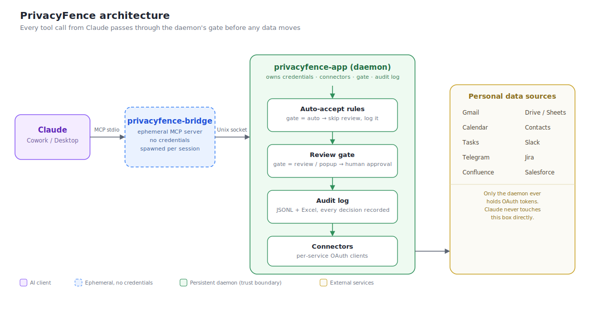

# PrivacyFence Technical Reference

This document contains the detailed operational and implementation reference for PrivacyFence.

For the product overview, governance model, screenshots, supported systems, and quick start, see the project [README](../README.md).

## Contents

- [Review model](#review-model)
- [Connectors & privacy matrix](#connectors--privacy-matrix)
- [Auto-accept grants](#auto-accept-grants)
- [Auto-accept rules](#auto-accept-rules)
- [Reading and proposing auto-accept changes from the bridge](#reading-and-proposing-auto-accept-changes-from-the-bridge)
- [Scheduled / unattended Cowork tasks](#scheduled--unattended-cowork-tasks)
- [Audit log](#audit-log)
- [Security, privacy & compliance](#security-privacy--compliance)
- [Installation](#installation)
- [Connecting Claude](#connecting-claude)
- [Building a DMG](#building-a-dmg)
- [Configuration reference](#configuration-reference)
- [Architecture notes](#architecture-notes)
- [License](#license)

## System overview

PrivacyFence uses a two-process architecture:

- **`privacyfence-bridge`** is the ephemeral MCP-facing process. It carries no connector credentials.
- **`privacyfence-app`** is the persistent daemon and authoritative control point. It owns credentials, policies, connectors, approvals, PII detection, and audit logging.



The sections below preserve the complete tool-level and implementation-level behavior.

---

## Review model

Every tool call passes through one of three gate values. `review` and `popup` are both native
macOS popups PrivacyFence shows itself (via `osascript`) — there is no separate Claude
Cowork-side approval step for either one. What differs between them is direction and button
set (see below).

| Gate | Behaviour |
|------|-----------|
| `auto` | Passed through immediately, logged as `auto_accepted` |
| `review` | Native popup approval — read direction (tool → Claude) |
| `popup` | Native popup approval — write direction (Claude → tool) |

### Two flows by direction

> **Note on MCP annotations (since v0.4.9):** the bridge advertises *every*
> tool — reads and writes alike — to Claude as `readOnlyHint = true` /
> `destructiveHint = false`. This is intentional. See
> [Why every tool is advertised as read-only](#why-every-tool-is-advertised-as-read-only) below.

Both flows below open the same kind of native popup — a summary box plus a scrollable pane with
the full content. The only differences are the button set and, on the read side, the PII scan
layered on top.

**Tool → Claude (reads) — gate `review`**

PrivacyFence opens a native popup with a summary box and a scrollable pane showing the full
content (e.g. the email body) up front, offering:

- **Allow once** — data is returned to Claude
- **Deny** — request is blocked; Claude receives an error
- **Always allow** — when a plausible rule can be derived from the item's attributes, proposes
  (with a second confirmation dialog) a standing [auto-accept rule](#auto-accept-rules) for
  similar future reads

**Claude → Tool (writes / actions) — gate `popup`**

Claude already describes the action it is about to take in the chat. PrivacyFence opens a native
popup showing the full action details with **Allow once** or **Deny** only — no **Always allow**, since
auto-accepting a write silently is a materially bigger blast radius than auto-accepting a read.

For write operations expected to be called repeatedly against the same file in quick succession —
`drive_sheets_write_range`, `drive_sheets_format_range`, `drive_sheets_insert_dimensions`,
`drive_add_comment`, `drive_docs_edit_content`, and `drive_docs_format_content` — the popup adds a
third button, **Allow for 5 min**: it auto-accepts further calls of that same operation against
that same file for 5 minutes, entirely in memory. Unlike a standing
[auto-accept rule](#auto-accept-rules), it's never written to `settings.yaml` and disappears on
daemon restart — a much smaller commitment than Always allow, appropriate for writes where a
standing rule isn't offered at all.

`drive_sheets_delete_dimensions` is deliberately excluded even though it's called in the same kind
of burst `drive_sheets_insert_dimensions` is: unlike every operation above, it removes cell
content (not just its appearance or position) with no undo path through PrivacyFence, so a
5-minute silent-acceptance window is a bigger commitment than for the others. It only ever gets
the standing-rule treatment described in [Auto-accept rules](#auto-accept-rules) below.

### PII detection gate

This gate only runs on the **`review` (read) direction — tool → Claude.** It exists to catch
personal data flowing from an external source into Claude's context, before you approve
handing it over. It does not run on the `popup` (write) direction — Claude → tool — since a
write is content Claude itself already generated for an action it described in chat (e.g.
`drive_write_file_content`, `gmail_create_draft`, `slack_send_message`), not external personal
data being newly exposed to it.

On top of the normal Allow once/Deny popup, PrivacyFence can scan the message/document/spreadsheet
content shown in every `review` dialog for likely personal data — in **Hungarian,
English, and German** — before you approve it: IBANs, credit card numbers, IP addresses, and
national identifiers (Hungarian TAJ/adóazonosító jel/ID card number, German
Steuer-ID/Sozialversicherungsnummer, US SSN, UK National Insurance number), plus common
labels like "date of birth" / "születési dátum" / "Geburtsdatum" and salary/compensation
references ("salary" / "fizetés" / "Gehalt") that flag a nearby value even when its own format
is too ambiguous to match structurally.

**Email addresses and phone numbers are deliberately not detected.** Nearly everything this
gate scans is email content, and nearly every email signature carries the sender's own address
and phone number — matching on those formats meant almost every read popup got flagged
regardless of whether the message actually contained anything sensitive, training users to
click through the warning without reading it. The other categories above (IBANs, national IDs,
etc.) are rare enough in ordinary correspondence that a hit is still a meaningful signal.

When something is flagged:

- The popup is tinted light red and shows a banner naming the categories found.
- After clicking **Allow once** (or **Always allow**), one more explicit **"Are you sure?"** dialog is
  required before the decision takes effect — declining it denies the whole request, the same as
  clicking **Deny** on the original popup.

This is a local, regex-based heuristic (see `src/privacyfence/pii_detector.py`) — it runs
entirely on-device with no network calls, and it can both miss real PII and flag things that
aren't; treat a hit as "look more carefully," not a guarantee either way. It never logs or stores
the matched text itself, only the category labels (e.g. "IBAN (bank account number)") — those
category labels, and whether any were flagged, are recorded in the [audit log](#audit-log).

The scan runs before any [auto-accept rule](#auto-accept-rules) is checked and overrides a
matching one: auto-accept rules are scoped to metadata (sender domain, folder, "I am the
organizer"), not content, so a rule that would otherwise pass a request through silently still
routes it to the normal popup — tinted, with the second confirmation — whenever the content itself
contains likely PII. A request that matches a rule *and* has no PII in its content still takes the
silent auto-accept path exactly as before this gate existed.

**Toggle:** enable or disable the whole gate from the menu bar (**PII Detection Gate**), or set
`pii_detection.enabled: true|false` directly in `config/settings.yaml`. Enabled by default.

---

## Connectors & privacy matrix

This section lists preview/details text per tool, grouped by connector. For a cut across *what
Claude already knows from prior auto-approved calls* before it ever reaches a given gated tool —
i.e. how much of a "review" tool's return value is actually new information — see
[`claude-knowledge-boundary.md`](claude-knowledge-boundary.md). For the approval dialog's own
layout and optional sections (AI-visibility checklist, PII banner, etc.), see
[`approval-window-content-reference.md`](approval-window-content-reference.md).

### Gmail

**Auth:** OAuth2

| Tool | Dir | Gate | Preview | Details popup |
|------|-----|------|----------------|---------------|
| `gmail_list_messages` | read | auto | — | — |
| `gmail_list_threads` | read | auto | — | — |
| `gmail_get_message` | read | review | from, recipients, date, subject | Full body text |
| `gmail_get_thread` | read | review | subject, all participants, message count, date range | All messages in thread |
| `gmail_list_message_attachments` | read | auto | — | — |
| `gmail_download_attachment` | read | review | from, subject, attachment name, size, save path | — |
| `gmail_create_draft` | write | popup | — | To, cc, subject, full body |
| `gmail_reply_draft` | write | popup | — | In reply to, to, cc/bcc, full reply body |
| `gmail_reply_all_draft` | write | popup | — | In reply to, to, also-to (expanded participants), cc/bcc, full reply body |
| `gmail_add_label` | write | popup | — | From, subject, label name |
| `gmail_remove_label` | write | popup | — | From, subject, label name |
| `gmail_archive_message` | write | popup | — | From, subject, confirmation that message stays in All Mail |
| `gmail_list_filters` | read | auto | — | — |
| `gmail_list_labels` | read | auto | — | — |
| `gmail_create_filter` | write | popup | — | Criteria, actions |
| `gmail_update_filter` | write | popup | — | Filter ID, criteria, actions, note that this deletes + recreates under a new id |
| `gmail_create_label` | write | popup | — | Label name, note when a parent segment will also be created |

### Google Drive

**Auth:** OAuth2

| Tool | Dir | Gate | Preview | Details popup |
|------|-----|------|----------------|---------------|
| `drive_list_files` | read | auto | — | — |
| `drive_get_file_metadata` | read | auto | — | — |
| `drive_list_folder` | read | auto | — | — |
| `drive_list_shared_drives` | read | auto | — | — |
| `drive_create_blank_file` | write | auto | — | — |
| `drive_get_file_content` | read | review | file name, owner, size, modified date | First ~500 chars of content |
| `drive_download_file` | read | review | file name, owner, size, save path | File name, owner, size, modified date, save path |
| `drive_write_file_content` | write | popup | — | File name, owner, new content (plain text) |
| `drive_upload_file` | write | popup | — | File name, size, destination folder |
| `drive_write_doc_content` | write | popup | — | File name, owner, Markdown preview (headings, bold/italic/strikethrough/underline/code, ==highlight==, links, nested lists, tables rendered as rich formatting in the Google Doc) |
| `drive_docs_edit_content` | write | popup | — | File name, owner; find/replace text goes in the details pane, not the preview |
| `drive_docs_format_content` | write | popup | — | File name, owner, formatting summary; the located text goes in the details pane |
| `drive_move_file` | write | popup | — | File name, from folder → to folder |
| `drive_add_comment` | write | popup | — | File name, full comment text |
| `drive_sheets_create` | write | auto | — | — |
| `drive_sheets_get_metadata` | read | auto | — | — |
| `drive_sheets_get_values` | read | review | spreadsheet name, owner, range | Cell values in the range |
| `drive_sheets_write_range` | write | popup | — | Spreadsheet name, owner, range, values/formulas being written |
| `drive_sheets_add_sheet` | write | popup | — | Spreadsheet name, owner, new tab title/dimensions |
| `drive_sheets_rename_sheet` | write | popup | — | Spreadsheet name, owner, tab id, new title |
| `drive_sheets_format_range` | write | popup | — | Spreadsheet name, owner, range, formatting being applied |
| `drive_sheets_insert_dimensions` | write | popup | — | Spreadsheet name, owner, tab id, rows/columns being inserted |
| `drive_sheets_delete_dimensions` | write | popup | — | Spreadsheet name, owner, tab id, rows/columns being deleted (data-loss warning) |

Google Sheets is not a separate connector — the `drive_sheets_*` tools live on the Drive
connector and reuse its OAuth grant (the Sheets API accepts the same `drive` scope). There is
intentionally no delete-sheet tool: `drive_sheets_rename_sheet` is the sanctioned way to mark a
tab for removal (e.g. rename it to `TO BE DELETED - <original title>`) — you delete it by hand
in the Sheets UI. `drive_sheets_write_range` has no separate "set formula" tool either — a cell
string starting with `=` is evaluated as a formula, exactly like typing it into the Sheets UI.

`drive_docs_edit_content` and `drive_docs_format_content` locate existing text in a Google Doc by
exact match against its plain text (the same representation `drive_get_file_content` returns) —
`find_text` must match exactly one location unless `replace_all` is set, so an ambiguous match
raises rather than guessing which occurrence was meant. Unlike `drive_write_doc_content`, they
touch only the matched span, not the whole document. `drive_sheets_insert_dimensions`/
`drive_sheets_delete_dimensions` insert or remove whole rows/columns (not just cell content) in a
tab, shifting everything after the insertion/deletion point; there is no undo path through
PrivacyFence for a delete.

### Slack

**Auth:** OAuth2 (browser sign-in), user token scope. Sees exactly what you see — no bot to invite. See [slack-setup.md](slack-setup.md).

| Tool | Dir | Gate | Preview | Details popup |
|------|-----|------|----------------|---------------|
| `slack_list_channels` | read | auto | — | — |
| `slack_get_channel_history` | read | review | channel name, message count, first message (80 chars) | All messages |
| `slack_get_thread_replies` | read | review | channel name, thread starter (80 chars), reply count | All replies |
| `slack_search_messages` | read | review | query, result count | All results |
| `slack_send_message` | write | popup | — | Channel name, full message text (optional `mark_unread=true` leaves the message unread after sending; requires `mark` scope) |

### Google Calendar

**Auth:** OAuth2

| Tool | Dir | Gate | Preview | Details popup |
|------|-----|------|----------------|---------------|
| `calendar_list_calendars` | read | auto | — | — |
| `calendar_list_events` | read | auto | — | — |
| `calendar_get_free_busy` | read | auto | — | — (returns full events when calendar access is available; falls back to busy-slot list otherwise) |
| `calendar_list_rooms` | read | auto | — | — (lists Google Workspace meeting rooms with name, email, building, floor, capacity; requires Workspace admin directory access) |
| `calendar_get_event_details` | read | review | title, time, organizer, attendee count | Description, full attendee list, conferencing link, file attachments (e.g. Gemini meeting notes/transcript) |
| `calendar_get_event_visibility` | read | auto | — | — |
| `calendar_create_event` | write | popup | — | Title, time, attendees, description, location, Google Meet flag, room bookings |
| `calendar_update_event` | write | popup | — | Title, time, fields changing (old → new), Google Meet flag, room bookings |
| `calendar_set_event_visibility` | write | popup | — | Event title, calendar, visibility change (old → new) |
| `calendar_create_out_of_office` | write | popup | — | Title, time, fixed "auto-decline new conflicts only" note, decline message |
| `calendar_set_working_location` | write | popup | — | Date, location (office/home), building/label if given |

`calendar_create_out_of_office` and `calendar_set_working_location` are only supported on the
primary calendar (a Google Calendar API restriction) and always create the event there regardless
of any `calendar_id` used elsewhere. The out-of-office auto-decline behavior is fixed to "decline
new conflicting invitations only" — Calendar also supports declining all conflicts or none, but
that isn't exposed here. Working-location presence only offers "office" or "home" (Calendar's third
"custom location" option isn't exposed either).

`calendar_get_event_visibility` returns just the `visibility` field ("default", "public",
"private", or "confidential") without the full attendee/description/attachment fetch
`calendar_get_event_details` does — cheap enough to be auto-approved on its own, the same way
`calendar_list_events` is. `calendar_set_event_visibility` changes only that one field; every other
property of the event is left untouched. There's no separate `calendar_create_event`/
`calendar_update_event` visibility parameter — set it via `calendar_set_event_visibility` after
creating or alongside updating the event.

### Google Contacts

**Auth:** OAuth2

| Tool | Dir | Gate | Preview | Details popup |
|------|-----|------|----------------|---------------|
| `contacts_list` | read | auto | — | — |
| `contacts_search` | read | auto | — | — |
| `contacts_get` | read | auto | — | — |
| `contacts_update` | write | popup | — | Contact name, fields changing (old → new) |
| `contacts_create` | write | popup | — | Name, fields being set |
| `contacts_add_label` | write | popup | — | Contact name, label (creates the label if it doesn't exist) |
| `contacts_remove_label` | write | popup | — | Contact name, label |

Contact deletion is not supported by this connector.

Google's People API blends personally-saved contacts together with Workspace
directory profiles (colleagues) into a single response by default. `contacts_list`,
`contacts_search`, and `contacts_get` each accept a `source` parameter
(`personal`, `directory`, or `both` — default `both`) to split them apart, and
every returned contact carries a `source` field (`personal`, `directory`, `both`
if it's a saved contact who's also a colleague, or `other` for unclassifiable
entries) plus the raw `source_types` it was derived from. `contacts_get` fails
if the fetched resource doesn't match the requested `source`. Directory search
(`contacts_search` with `source="directory"`) is limited to directory profiles
you already have some contact history with — there is no full company-directory
search under this connector's OAuth scope.

### Telegram

**Auth:** Telethon (MTProto). Reads your chats as you, not as a bot.

| Tool | Dir | Gate | Preview | Details popup |
|------|-----|------|----------------|---------------|
| `telegram_list_chats` | read | auto | — | — |
| `telegram_get_messages` | read | review | chat name, message count | All messages |
| `telegram_search_messages` | read | review | query, result count | All results |
| `telegram_send_message` | write | popup | — | Chat name, full message text |

### Salesforce

**Auth:** OAuth2 (browser sign-in via a Connected App). See [salesforce-setup.md](salesforce-setup.md).

| Tool | Dir | Gate | Preview | Details popup |
|------|-----|------|----------------|---------------|
| `salesforce_list_reports` | read | auto | — | — |
| `salesforce_get_record` | read | review | object type, record name, record ID | All field values |
| `salesforce_run_report` | read | review | report name, report ID | All report rows |
| `salesforce_search` | read | review | search term, object types, result count | One line per match: object type, name, id |

`salesforce_search` is the same mechanism (SOSL) behind the search bar at the top of the
Salesforce UI — search by name or id across one or more object types, optionally scoped to one
Account's related records (`account_id`, requires `object_types` to be set). Results are
lightweight Id/Name matches, not full records — call `salesforce_get_record` for full field
details on a match, the same search-then-drill-in split `jira_search_issues`/`jira_get_issue`
already use.

### Jira

**Auth:** OAuth2 (browser sign-in, Atlassian 3LO). Shared with Confluence — one sign-in covers both. See [atlassian-setup.md](atlassian-setup.md).

| Tool | Dir | Gate | Preview | Details popup |
|------|-----|------|----------------|---------------|
| `jira_list_projects` | read | auto | — | — |
| `jira_search_issues` | read | auto | — | — |
| `jira_get_issue` | read | review | project name, key, summary, status, assignee | Description, comments, all fields |
| `jira_get_transitions` | read | auto | — | — |
| `jira_create_issue` | write | popup | — | Project, type, summary, full description |
| `jira_add_comment` | write | popup | — | Issue key + summary, full comment |
| `jira_update_issue` | write | popup | — | Issue key + summary, fields (old → new), including custom fields |
| `jira_transition_issue` | write | popup | — | Issue key + summary, status (old → new) |

`jira_update_issue`'s `custom_fields` parameter takes a JSON object keyed by each custom field's
**display name** exactly as shown in the Jira UI (e.g. `{"Story Points": 5}`) — never the internal
`customfield_NNNNN` id. The connector resolves the name via Jira's field metadata and shapes the
value for select-list (single- and multi-option) fields automatically; fields needing a structured
reference the name alone can't supply (e.g. a user-picker field, which needs an `accountId`) are
passed through as-is and surface Jira's own validation error if the shape is wrong.
`jira_transition_issue` moves an issue by transition name (e.g. "Done") — call
`jira_get_transitions` first to see which names are valid from the issue's current status.

### Confluence

**Auth:** OAuth2 (browser sign-in, Atlassian 3LO), shared with Jira — one sign-in covers both. See [atlassian-setup.md](atlassian-setup.md).

| Tool | Dir | Gate | Preview | Details popup |
|------|-----|------|----------------|---------------|
| `confluence_list_spaces` | read | auto | — | — |
| `confluence_search` | read | auto | — | — |
| `confluence_cql_search` | read | auto | — | — |
| `confluence_list_pages` | read | auto | — | — |
| `confluence_get_page` | read | review | title, space, author, last modified | Full page body |
| `confluence_get_page_by_title` | read | review | title, space, author, last modified | Full page body |
| `confluence_create_page` | write | popup | — | Space, title, parent page, full body |
| `confluence_update_page` | write | popup | — | Title, space, full new body |

### Google Tasks

**Auth:** OAuth2

| Tool | Dir | Gate | Preview | Details popup |
|------|-----|------|----------------|---------------|
| `tasks_list_task_lists` | read | auto | — | — |
| `tasks_list_tasks` | read | auto | — | — |
| `tasks_get_task` | read | auto | — | — |
| `tasks_create_task` | write | popup | — | Task list, title, due date, full notes |
| `tasks_update_task` | write | popup | — | Task list, task, new title/due date, full notes |
| `tasks_complete_task` | write | popup | — | Task list, task |
| `tasks_uncomplete_task` | write | popup | — | Task list, task |
| `tasks_move_task` | write | popup | — | Task, from list, to list |

---

## Auto-accept grants

Trusting a specific resource — a Drive folder, a Google Tasks list, a Slack channel, a Jira
project, ... — is configured **once per resource**, under `auto_accept_grants` in
`config/settings.yaml`, rather than by adding the same ID to every operation key that resource
happens to touch (see [Auto-accept rules](#auto-accept-rules) below for what that used to require).
This is also what the menu bar's **Manage Auto-accept Rules… → \<Connector\> → Trusted \<Resource\>**
sections read and write — editing the YAML directly and editing from that window are equivalent.

```yaml
auto_accept_grants:
  drive:
    sandbox_folders:
      - id: "1CdeFghIJKLmnoPQRstuVWxyz0123456789AbCdEfGh"
        name: "Claude scratch space"   # cosmetic — see below
        write: true
    folders:
      - id: "1BxiMVs0XRA5nFMdKvBdBZjgmUUqptlbs74OgVE2upms"
        name: "Shared Reports"
        read: true
  tasks:
    task_lists:
      - id: "MDAwMDAwMDAwMDAwMDAwMDAwMDA6MDow"
        name: "Personal"
        create: true
        edit: true
        complete: true
        move: true
```

Each grant entry is keyed by `id` (or `key` for Jira/Confluence, which already address resources
that way) plus a small set of capability booleans. A freshly added grant starts with every
capability `false` — adding a resource does nothing until a capability is explicitly turned on,
from the menu or by hand. `name` is a cosmetic cache of the resource's last-resolved display name;
the evaluator never reads it, only `id`/`key` and the capability booleans decide what auto-accepts.

### What each resource type covers

| Connector | Resource type (`config_key`) | Capabilities → what they auto-accept |
|---|---|---|
| `drive` | `folders` | `read` → reading file contents/downloads in that folder, and `sheets.read_values` for spreadsheets in it |
| `drive` | `sandbox_folders` | `write` → writing files/Docs in that folder (including `docs.edit_content`/`docs.format_content`), and every `sheets.*` write operation for spreadsheets in it |
| `drive` | `spreadsheets` (optionally scoped to one `tab`) | `read` → `sheets.read_values`; `write` → every `sheets.*` write operation (`write_range`/`add_sheet`/`rename_sheet`/`format_range`/`insert_dimensions`/`delete_dimensions`) |
| `tasks` | `task_lists` | `create`, `edit`, `complete` (covers complete + uncomplete), `move` — one per Tasks write tool |
| `slack` | `channels` | `read` → reading channel/thread history and search results in that channel; `send` → sending messages there |
| `telegram` | `chats` | `read` → reading/searching that chat; `send` → sending messages there |
| `jira` | `projects` (by `key`) | `read`, `create`, `comment`, `update`, `transition` — one per Jira tool |
| `confluence` | `spaces` (by `key`) | `read`, `create`, `update` — one per Confluence tool |
| `calendar` | `calendars` | `read` → reading event details on that calendar; `write` → creating/updating events there |
| `salesforce` | `reports` | `run` → running that specific report |

`drive.upload_file`'s destination-folder allowlist (`parent_folder_allowlist`) and
`drive.move_file`'s move-approval (`move_within_approved_folders`) are deliberately **not** part of
the `folders`/`sandbox_folders` grants above — upload-destination and move-both-ends are different
enough semantics from "read this folder" / "write into this sandbox" that folding them in would
misrepresent what a capability checkbox grants. They stay configured under `auto_accept_rules`
(see below), in the connector's per-operation sections.

### Menu bar UX

Under **Manage Auto-accept Rules… → \<Connector\>**, each resource type above gets its own **Trusted
\<Resource\>** section: every currently-granted resource is its own row, labeled with its
**resolved name** (not the raw ID — see below), with one checkbox per capability, a **Copy ID**
action, and its own **✕ Remove**. Adding one is a single **+ Add …** action:

- For connectors with a cheap listing call (Tasks, Slack, Telegram, Jira, Confluence, Calendar,
  Salesforce reports), **+ Add …** opens a native picker of everything visible to that connector,
  by name — no ID entry needed at all.
- For Drive folders and spreadsheets (no "list every folder I can see" API short of the heavier
  Google Picker integration), **+ Add …** accepts a pasted ID **or** a full Drive/Sheets URL (the
  ID is extracted automatically), resolves and shows the name back for confirmation before saving.

Every existing rule under `auto_accept_rules` that isn't a resource grant (domain trust, label
matching, file-type allowlists, and similar — see [Auto-accept rules](#auto-accept-rules)) lives
in that same connector's **Filters** submenu, with the same one-value-at-a-time **+ Add value…** /
**✕ Remove** treatment — there's no shared multi-line text box to paste several IDs into anywhere
in this menu.

### Name resolution

Grant rows show the resource's real name, resolved via the same connector API calls used
elsewhere in the daemon (e.g. `drive_get_file_metadata`, `tasks_list_task_lists`), cached
in-memory (short TTL) and on disk (`resource_name_cache.json` next to the rest of PrivacyFence's
data) so a name is available immediately even before a connector has reconnected this session.
Resolution never blocks or changes an auto-accept decision — a row falls back to the ID itself,
annotated "(resolving…)" or "(connect \<Connector\> to see its name)", if a name isn't available
yet or the connector isn't currently authenticated.

### Relationship to `auto_accept_rules`

`auto_accept_grants` and `auto_accept_rules` are both read every time rules are (re)loaded — a
grant's enabled capabilities compile into the exact same `{rule, value}` shape a hand-written entry
under `auto_accept_rules` already used, so the evaluator itself has no separate code path for
grants. Existing hand-written `auto_accept_rules` entries keep working unmodified.

On first startup after upgrading to a version with this feature, PrivacyFence looks for
`auto_accept_rules` entries that exactly match what a grant's capability would already produce —
i.e. the same rule value repeated identically across *every* operation key that capability covers
— and folds those into `auto_accept_grants` automatically, removing the now-redundant
`auto_accept_rules` entries. This runs once (tracked by a `migrated_to_grants_v1` marker) and is
logged at `INFO` level. A **partial** match (the value present on some but not all of a
capability's operation keys) is deliberately left alone rather than migrated, since folding it in
would silently widen auto-accept to operation keys never explicitly configured — those stay under
`auto_accept_rules`, visible and removable from the connector's Filters submenu, but no longer
offered as something "+ Add rule…" creates fresh (steering new configuration toward the grants
model without breaking what's already there).

---

## Auto-accept rules

Beyond the connector/resource-scoped [grants](#auto-accept-grants) above, routine, low-risk
requests can also be approved automatically based on an *attribute* of the request rather than a
specific resource's identity — sender domain, label, file type, and similar, where there's no
single resource ID to grant trust to once. These stay configured per operation in
`config/settings.yaml` under `auto_accept_rules`. When a rule matches, the gate is bypassed and the
request is logged as `auto_accepted`.

### Available rules

**Gmail**

| Rule | Matches when… |
|------|--------------|
| `i_am_sender` | The authenticated account is the sender |
| `i_am_sole_recipient` | The only recipient is the authenticated account |
| `trusted_sender_domain` | Sender's domain is in the allowlist, including subdomains (e.g. `mail.trusted.com` matches an allowlisted `trusted.com`) |
| `label_match` | Message carries one of the specified labels |
| `age_threshold_days` | Message is older than N days |
| `no_attachments` | Message has no attachments |

These apply to Gmail's read tools. Gmail's write tools (`gmail_create_draft`, `gmail_reply_draft`,
`gmail_reply_all_draft`, `gmail_add_label`, `gmail_remove_label`, `gmail_create_label`) have their
own rules:

| Rule | Matches when… |
|------|--------------|
| `to_is_myself` | Every recipient of the draft/reply is the authenticated account itself |
| `approved_recipient_domain` | Every recipient's domain is in the allowlist |
| `label_name_allowlist` | The label being added/removed/created is in the allowlist |

`gmail_create_filter` and `gmail_update_filter` have no built-in rule and always prompt — a
filter's criteria/action combination is too open-ended for a simple allowlist match.

**Google Drive**

| Rule | Matches when… |
|------|--------------|
| `i_am_owner` / `created_by_me` | Authenticated account owns the file |
| `approved_folder` | File is in an approved folder (by Drive folder ID) |
| `approved_sandbox_folder` | File is in an approved sandbox folder |
| `move_within_approved_folders` | Move operation stays within approved folders |
| `file_type_allowlist` | File MIME type is in the allowlist |
| `created_this_session` | File was created by Claude in the current session |
| `shared_drive_exclusion` | File is NOT on a shared drive |

`drive_upload_file` additionally supports `parent_folder_allowlist` (matches when the upload's
destination folder ID is in the allowlist).

> **`approved_folder` and `approved_sandbox_folder` are grant-managed** — see
> [Auto-accept grants](#auto-accept-grants) → `drive.folders` / `drive.sandbox_folders`. Add the
> folder there once (from the menu bar's **Trusted Folders** / **Sandbox Folders** submenus, or by
> hand under `auto_accept_grants`) and it applies across every operation key below automatically,
> instead of needing the same folder ID added to each one separately. `parent_folder_allowlist` and
> `move_within_approved_folders` remain configured directly under `auto_accept_rules` (see
> [Auto-accept grants](#auto-accept-grants) for why they're not folded into the same grant).

The same rules apply to the `drive_sheets_*` tools, under their own operation keys so they can be
configured independently of plain-file Drive operations: `sheets.read_values` (`i_am_owner`,
`created_by_me`, `approved_folder`, `created_this_session`, `shared_drive_exclusion`) and
`sheets.write_range` / `sheets.add_sheet` / `sheets.rename_sheet` / `sheets.format_range` /
`sheets.insert_dimensions` / `sheets.delete_dimensions`
(`i_am_owner`, `approved_sandbox_folder`, `created_this_session`). A spreadsheet is a Drive file,
so e.g. `created_this_session` fires for a spreadsheet `drive_sheets_create` made earlier in the
same conversation. `approved_folder`/`approved_sandbox_folder` on these seven operation keys
(`sheets.read_values` plus the six `sheets.*` writes) are the same grant-managed rules as above —
one `drive.folders`/`drive.sandbox_folders` grant covers all of plain Drive reads/writes and every
one of these `sheets.*` operations at once, instead of needing the same folder ID added to each one
separately (the old, still-fully-supported way — configure each rule independently under
`auto_accept_rules`, as before grants existed).

All seven `sheets.*` operations also accept `approved_spreadsheet`, which scopes a rule to one
specific spreadsheet — optionally narrowed to one tab within it. This is also grant-managed (see
[Auto-accept grants](#auto-accept-grants) → `drive.spreadsheets`); the underlying rule shape is:

```yaml
auto_accept_rules:
  sheets.read_values:
    - rule: approved_spreadsheet
      value:
        - spreadsheet_id: "1BxiMVs0XRA5nFMdKvBdBZjgmUUqptlbs74OgVE2upms"   # whole spreadsheet, any tab
        - spreadsheet_id: "1AbCdEf..."
          tab: "Budget"                                                   # only this tab
```

`spreadsheet_id` is the ID from the sheet's URL
(`docs.google.com/spreadsheets/d/<spreadsheet_id>/edit`). `tab` is optional — omit it to approve
every tab of that spreadsheet. When present, `tab` means the tab's **name** (e.g. `"Sheet1"`) for
`sheets.read_values` / `sheets.write_range`, since that's all range_a1 carries (`"Sheet1!A1:C10"`);
for `sheets.rename_sheet` / `sheets.format_range` / `sheets.insert_dimensions` /
`sheets.delete_dimensions` it means the tab's **numeric** `sheet_id` (from
`drive_sheets_get_metadata`) as a string, since those tools address the tab that way instead.
`sheets.add_sheet` has no existing tab to scope to, so only bare `spreadsheet_id` entries apply
there.

Clicking **Always allow** on a "Read Sheet Values" prompt proposes exactly this rule — scoped to the
spreadsheet and tab you just read — rather than a broader ownership- or folder-based rule.

`drive.comment_file` (`drive_add_comment` — also used for comments on Docs and Sheets, since those
ride the Drive connector's OAuth grant) supports `i_am_owner` and `created_this_session` the same
way plain Drive files do. `docs.edit_content` and `docs.format_content` (`drive_docs_edit_content`/
`drive_docs_format_content`) support the same rules `drive.write_doc` does — `i_am_owner`,
`approved_sandbox_folder`, `created_this_session` — under their own operation keys.
`approved_sandbox_folder` here is the same `drive.sandbox_folders` grant covered above — enabling
its `write` capability auto-accepts `docs.edit_content`/`docs.format_content` too, alongside
`drive.write_file`/`drive.write_doc` and every `sheets.*` write.

**Write ops have no Always allow, but some get "Allow for 5 min" instead.** All of the above
(including the writes) are `popup`-gated, and unlike `review`-gated reads, a write popup never
offers to create a standing rule — see [PII detection gate](#pii-detection-gate) and the
[review model](#review-model) above for why. `sheets.write_range`, `sheets.format_range`,
`sheets.insert_dimensions`, `drive.comment_file`, `docs.edit_content`, and `docs.format_content`
are the exception: their popup additionally offers **Allow for 5 min**, an in-memory,
non-persisted acceptance scoped to one spreadsheet/file for 5 minutes — see
[Two flows by direction](#two-flows-by-direction). `sheets.add_sheet` and `sheets.rename_sheet`
get neither; they're one-shot per file rather than something called repeatedly in a burst, so a
standing rule (configured as above) is the only way to skip their popup. `sheets.delete_dimensions`
also deliberately gets neither, despite being called in the same kind of burst
`sheets.insert_dimensions` is: unlike insert/format, deleting rows or columns removes cell content
with no undo path through PrivacyFence, so it only ever gets the standing-rule treatment — see
[Two flows by direction](#two-flows-by-direction) for the reasoning.

**Slack**

| Rule | Matches when… |
|------|--------------|
| `dm_with_myself` / `send_to_myself` | Target channel is a self-DM |
| `approved_channel` / `approved_recipient` | Channel ID is in the allowlist |
| `public_channels_only` | All messages are from public channels |
| `no_file_attachments` | Messages have no file attachments |
| `reply_in_existing_thread` | Message is a reply (has `thread_ts`) |

> **`approved_channel`/`approved_recipient` are grant-managed** — see
> [Auto-accept grants](#auto-accept-grants) → `slack.channels`. One channel grant's `read`/`send`
> capabilities cover both rules above.

**Google Calendar**

| Rule | Matches when… |
|------|--------------|
| `i_am_organizer` | Authenticated account is the event organizer |
| `no_external_attendees` | All attendees share the same email domain |
| `personal_calendar` | Event is from a specified calendar ID |
| `past_event` | Event end time is in the past |
| `time_window_days` | Event starts within the next N days |
| `no_conferencing_link` | Event has no video conferencing link |
| `non_private_event` | The event's visibility is not `private` |

> **`personal_calendar` is grant-managed** — see [Auto-accept grants](#auto-accept-grants) →
> `calendar.calendars`. One calendar grant's `read`/`write` capabilities cover
> `calendar.read_event_details`, `calendar.create_modify_event`, and `calendar.set_visibility`.

`calendar_create_out_of_office` (`calendar.out_of_office`) and `calendar_set_working_location`
(`calendar.working_location`) each have their own operation key but no rule above applies to
either — both always act on your own primary calendar with no organizer/attendee/other-calendar
concept for these rules to check — so they remain `popup`-gated with no configurable auto-accept,
unlike `calendar_create_event`/`calendar_update_event` above.

`calendar_set_event_visibility` (`calendar.set_visibility`) is a write like
`calendar_create_event`/`calendar_update_event`, so it shares `calendar.create_modify_event`'s
rule set (`i_am_organizer`, `no_external_attendees`, `personal_calendar`) rather than getting a
rule of its own — `non_private_event` only applies to `calendar.read_event_details`. Clicking
**Always allow** on a "Read Calendar Event" prompt proposes `non_private_event` when the event
isn't private and neither `i_am_organizer` nor `no_external_attendees` apply.

**Salesforce**

| Rule | Matches when… |
|------|--------------|
| `approved_object_types` | Object type (Account, Contact, …) is in the allowlist — for `salesforce_search` (`salesforce.search`), every object type in its comma-separated `object_types` must be on the allowlist, not just one |
| `approved_report_ids` | Report ID is in the approved list |

> **`approved_report_ids` is grant-managed** — see [Auto-accept grants](#auto-accept-grants) →
> `salesforce.reports`. `approved_object_types` is a small fixed vocabulary (not a resource
> identity) and stays a plain rule.

`salesforce_search` with no `object_types` given reaches Salesforce's whole default set of
globally-searchable objects — too broad for `approved_object_types` to ever match, so an unscoped
search always prompts (or needs a differently-shaped rule, none of which exist yet).

**Google Contacts**

| Rule | Matches when… |
|------|--------------|
| `no_contact_info_change` | The update doesn't touch `emails` or `phones` (name/organization/notes-only edits) |

**Jira**

| Rule | Matches when… |
|------|--------------|
| `i_am_reporter` | Authenticated account is the issue's reporter |
| `i_am_assignee` | Authenticated account is the issue's assignee |
| `approved_project_keys` | Issue's project key is in the allowlist |

`jira_transition_issue` (`jira.transition_issue`) also accepts `approved_project_keys` — it derives
the project from `issue_key` the same way `jira_get_issue`/`jira_update_issue` do. `i_am_reporter` /
`i_am_assignee` don't apply to it, since a transition call doesn't carry the issue's reporter/assignee.

> **`approved_project_keys` is grant-managed** — see [Auto-accept grants](#auto-accept-grants) →
> `jira.projects`. One project grant's `read`/`create`/`comment`/`update`/`transition`
> capabilities cover all five rules above at once, instead of adding the same project key
> separately to `jira.read_issue`, `jira.create_issue`, `jira.add_comment`, `jira.update_issue`,
> and `jira.transition_issue`.

**Confluence**

| Rule | Matches when… |
|------|--------------|
| `i_am_author` | Authenticated account is the page's author |
| `approved_space_keys` | Page's space key is in the allowlist |

> **`approved_space_keys` is grant-managed** — see [Auto-accept grants](#auto-accept-grants) →
> `confluence.spaces`. One space grant's `read`/`create`/`update` capabilities cover
> `confluence.read_page`, `confluence.create_page`, and `confluence.update_page` at once.

**Telegram**

| Rule | Matches when… |
|------|--------------|
| `approved_chats` | Chat ID is in the allowlist |
| `no_media_attachments` | Messages have no media attachments |

> **`approved_chats` is grant-managed** — see [Auto-accept grants](#auto-accept-grants) →
> `telegram.chats`. One chat grant's `read`/`send` capabilities cover both
> `telegram.read_chat_messages` and `telegram.send_message`.

**Google Tasks**

| Rule | Matches when… |
|------|--------------|
| `approved_task_list` | Task list is in the allowlist — for `tasks_move_task`, both the source and destination list must be |

`approved_task_list` applies independently to each of `tasks.create_task`, `tasks.update_task`,
`tasks.complete_task`, `tasks.uncomplete_task`, and `tasks.move_task`, so you can e.g. auto-accept
edits within a personal list while still requiring review for creates.

> **`approved_task_list` is grant-managed** — see [Auto-accept grants](#auto-accept-grants) →
> `tasks.task_lists`. One task-list grant's `create`/`edit`/`complete`/`move` capabilities cover
> all five task-write operations at once (`complete` covers both complete and uncomplete).

> **Google Contacts**: `contacts_list`, `contacts_search`, and `contacts_get` are unconditionally auto-accepted. `contacts_update`, `contacts_create`, `contacts_add_label`, and `contacts_remove_label` are all `popup`-gated; `no_contact_info_change` above is the only configurable auto-accept rule, and it applies only to `contacts_update`. Contact deletion is not supported. **Google Tasks**: all three read tools plus `tasks_list_task_lists` are unconditionally auto-accepted; the five write tools (`tasks_create_task`, `tasks_update_task`, `tasks_complete_task`, `tasks_uncomplete_task`, `tasks_move_task`) are `popup`-gated, each independently configurable via `approved_task_list` above. **Telegram**: `telegram_list_chats` is unconditionally auto-accepted; `telegram_get_messages` and `telegram_search_messages` are `review`-gated by default but configurable via the rules above; `telegram_send_message` is `popup`-gated with no configurable rule. **Jira and Confluence** read tools (`jira_get_issue`, `confluence_get_page`, `confluence_get_page_by_title`) are `review`-gated by default but configurable via the rules above; their write tools remain `popup`-gated with no configurable rule, except `jira_transition_issue`, which accepts `approved_project_keys` as noted above.

---

## Reading and proposing auto-accept changes from the bridge

Until now, `auto_accept_rules`/`auto_accept_grants` were only readable/writable from the daemon
side — the menu bar's Rules Manager window (`rules_manager_window.py`) or the "Always allow"
confirmation described above. Two more bridge meta-tools close that gap, so Claude can inspect and
propose changes to this config directly:

### `privacyfence_list_auto_accept_rules` — read

```
privacyfence_list_auto_accept_rules(reason) -> {
    "auto_accept_rules": {<operation_key>: [{"rule": <str>, "value": <any>}, ...]},
    "auto_accept_grants": {<connector>: {<config_key>: [{...grant entry...}, ...]}},
}
```

The raw, addressable config sections straight from `settings.yaml` — not the compiled/merged view
the evaluator uses internally — so a caller can identify an existing entry by its exact fields
before proposing a change to it. No popup, no mutation, no external API call; records a lightweight
`rules_listed` audit entry (see [Audit log](#audit-log)) since it discloses the full current rule
set, the same reasoning as `privacyfence_check_policy`'s `policy_check` entry.

### `privacyfence_propose_auto_accept_rule_change` — write, always gated

```
privacyfence_propose_auto_accept_rule_change(target, operation, reason, ...) -> {
    "confirmed": true, "changed": <bool>, "description": "<str>",
}
```

`target` is `"rule"` (an `auto_accept_rules` entry) or `"grant"` (an `auto_accept_grants` entry);
`operation` is `"add"`, `"update"`, or `"remove"`. This is the one write path a bridge connection
has into `settings.yaml`, and there is no way to reach it without a human confirming: every call
blocks on the same native confirmation dialog the "Always allow" button uses
(`show_rule_confirmation_popup`) — even if an identical rule/grant already exists. A decline (or a
call from a connection in an [unattended session](#scheduled--unattended-cowork-tasks)) makes the
call throw rather than return a false-y result, the same "deny == exception" contract every other
gated tool call already follows.

- `target="rule"` fields: `operation_key`, `rule_name`, `value` (required for add/update — often a
  list, matching the shape shown under [Auto-accept rules](#auto-accept-rules)), `old_value`
  (update only — the prior value being replaced; omit to add alongside the existing value instead
  of replacing it).
- `target="grant"` fields: `connector`, `config_key`, `resource_id` (required), `name` (optional
  cosmetic label), `tab` (spreadsheets only), `capabilities` (add/update only — a map of capability
  key, e.g. `"write"`, to `true`/`false`; see the capability tables under
  [Auto-accept grants](#auto-accept-grants) for which keys apply to which resource type).

Applying the change reuses the exact same persistence functions the menu bar's editor and the
"Always allow" flow already use (`auto_accept.add_auto_accept_rule`/`remove_auto_accept_rule`,
`resource_grants.apply_grant_upsert`/`apply_grant_removal`), so a bridge-proposed change hot-reloads
the live evaluator the same way. It's recorded as one of four new audit decisions —
`rule_changed_via_bridge_proposal`, `rule_removed_via_bridge_proposal`,
`grant_changed_via_bridge_proposal`, `grant_removed_via_bridge_proposal` — distinguishable from a
UI-originated change; a decline reuses the existing `rejected` decision rather than a new value.

Motivating example: a user's config can accumulate many individual `sheets.*` operations each
hand-pinned to `approved_sandbox_folder` (see the callout under
[Auto-accept rules](#auto-accept-rules)) when what's actually wanted is one
`auto_accept_grants.drive.sandbox_folders` grant. With these two tools, Claude can list the current
rules, identify the duplicates, and propose removing them and adding the equivalent grant instead —
each step still confirmed by a human, same as if they'd done it by hand in the Rules Manager.

---

## Scheduled / unattended Cowork tasks

A scheduled Claude Cowork Routine can run with nobody at the keyboard. If it calls a `review`- or
`popup`-gated tool that no auto-accept rule covers, the normal behavior — open a native popup and
wait — means the task hangs indefinitely, and since every popup shares one lock, it also blocks
every other approval (including an unrelated interactive one) behind it until someone finds and
answers the dialog. Two additions address this. Design rationale (why a `contextvars`-scoped flag
rather than a connector-level change, why args-only rules are classified by hand rather than
inferred, alternatives considered) lives in code comments at the relevant call sites —
`gate.py`'s `unattended_scope`/`is_unattended`, `auto_accept.py`'s `ARGS_ONLY_RULES`/
`DATA_DEPENDENT_RULES`, and `ipc_server.py`'s `_begin_unattended_session`.

### `privacyfence_check_policy` — preflight

A bridge meta-tool (not backed by any connector) Claude can call before actually calling a gated
tool, to find out whether that specific call would need a human:

```
privacyfence_check_policy(connector, tool, reason, args) -> {
    "gate": "auto" | "review" | "popup",
    "verdict": "auto_accept" | "requires_review" | "unknown",
    "matched_rule": <str | null>,
    "reason": "<str>",
    "pii_gate_may_apply": <bool>,
}
```

`reason` (required, same as every gated tool's — self-reported and unverified, logged as-is, never
treated as fact) is one sentence on why Claude is checking this right now; recorded on the
resulting `policy_check` audit entry, since that entry has no underlying tool call to take a reason
from otherwise.

It never calls a connector, opens a popup, or has any side effect beyond a lightweight
`policy_check` audit entry (see [Audit log](#audit-log)) — safe to call as often as needed while
planning a task. The verdict is only ever as certain as the underlying rule allows:

- `auto_accept` — a rule matched using only the call's arguments (or an active "Allow for 5 min"
  window); the real call will auto-accept identically.
- `requires_review` — every rule configured for this operation only needs arguments, and none
  matched; fetching the real data cannot change that answer.
- `unknown` — at least one configured rule needs the actual fetched item (e.g. `i_am_owner`,
  `trusted_sender_domain`) to decide, which a preflight check can't see in advance.

For `review`-gated (read) tools, `pii_gate_may_apply` is always `true`: the
[PII detection gate](#pii-detection-gate) scans real content and can force a popup even when a
rule matches, and that can never be predicted before the read happens.

### Unattended sessions — fail fast instead of hang

`privacyfence_begin_unattended_session(reason)` / `privacyfence_end_unattended_session(reason)`
(also bridge meta-tools, each with a required `reason` — same self-reported, unverified, one
sentence contract as `privacyfence_check_policy`'s) let Claude mark the current connection as
running a scheduled/unattended task, for as long as that connection stays open. `reason` is
recorded on the resulting `unattended_session_started`/`unattended_session_ended` audit entry —
for calls this session denies without ever showing a popup, it's the only human-legible record of
why the session was unattended in the first place. While marked, any `review`/`popup` call on that connection
that isn't already covered by a matching auto-accept rule is **denied immediately** — audited as
`denied_unattended`, distinct from a human's own `rejected` — instead of opening a popup nobody
will answer. This applies even when a rule matched but the [PII gate](#pii-detection-gate) still
routed the call to a human. Nothing that would auto-accept today stops auto-accepting; this only
changes the failure mode for calls that would otherwise open an unanswered dialog and hold up
every other approval behind it.

**Off by default.** Set in the organization config bundle (`org_config.json`, installed via
"Install/Update Organization Config…" in the menu bar — see
[scripts/build_org_bundle.py](../scripts/build_org_bundle.py)'s `--enable-unattended-sessions`
flag), not in `settings.yaml`:

```json
{
  "unattended_sessions": { "enabled": true }
}
```

`privacyfence_begin_unattended_session` errors until an administrator opts in — a Claude session
gaining the ability to switch its own connection into fail-fast mode is a deliberate
per-organization choice, not a per-user setting, so it isn't exposed as a menu bar toggle. The
unattended flag is connection-scoped (the bridge is one process per Cowork task) and clears
automatically if the connection drops, so there's no persistent state to clean up. While one or
more connections are in this state, the menu bar's top item shows a live count (e.g. "PrivacyFence
is running — 1 unattended session active").

---

## Audit log

Every decision — accepted, denied, or auto-accepted — is appended to a JSON-lines file in `logs/audit/YYYY-WNN.jsonl`. At startup, any week that has a `.jsonl` file but no `.xlsx` is automatically exported to a formatted Excel workbook with a colour-coded **Decisions** sheet and a **Summary** tab. Each entry also records whether the [PII detection gate](#pii-detection-gate) flagged the content (category labels only — never the matched text itself).

Two decision values relate to [scheduled/unattended tasks](#scheduled--unattended-cowork-tasks):
`denied_unattended` (a call denied without ever prompting, because the connection was in an
unattended session and no auto-accept rule matched — kept distinct from a human's own `rejected`)
and `policy_check` (a `privacyfence_check_policy` preflight call — not a real decision, recorded
for pattern-spotting only). Both get their own row on the Summary sheet and their own colour on
the Decisions sheet.

Five more relate to
[reading/proposing auto-accept changes from the bridge](#reading-and-proposing-auto-accept-changes-from-the-bridge):
`rules_listed` (a `privacyfence_list_auto_accept_rules` call — like `policy_check`, not a real
decision, recorded because it discloses the full current rule set) and, once a
`privacyfence_propose_auto_accept_rule_change` proposal is confirmed,
`rule_changed_via_bridge_proposal` / `rule_removed_via_bridge_proposal` /
`grant_changed_via_bridge_proposal` / `grant_removed_via_bridge_proposal`. A declined proposal
reuses the existing `rejected` decision rather than a new value.

See [connector-qa-testing.md](connector-qa-testing.md) for a Claude Cowork prompt that drives every connector's tools end to end against real accounts — the fastest way to catch a gate, auto-accept rule, or connector client that's drifted from what's documented here.

---

## Security, privacy & compliance

For information security, IT, GDPR, and EU AI Act reviewers: see
[security-and-compliance.md](security-and-compliance.md) for the deployment model
(local, not SaaS), IT's connector-level access authority, the human-in-the-loop review model,
data handling, and PrivacyFence's positioning under GDPR and the AI Act.

---

## Installation

PrivacyFence splits configuration into two steps done by two different people:

1. **IT admin, once per organization:** register a cloud app for each service you want (Google,
   Slack, Salesforce, Atlassian) and package the result into one organization config bundle with
   `scripts/build_org_bundle.py`. See the "For IT admins" section of each doc below. Telegram is
   not part of this step — its `api_id`/`api_hash` identify the PrivacyFence app itself, not your
   organization, and are already baked into the release build.
2. **Every user, from the PrivacyFence menu bar:** install the bundle IT sent you, then click
   **Authenticate…** on each connector you want. Almost everywhere this opens your browser to sign
   in — Telegram is the only connector that instead asks for your phone number and a verification
   code, since MTProto has no browser-OAuth equivalent.

> See [google-cloud-setup.md](google-cloud-setup.md), [slack-setup.md](slack-setup.md), [salesforce-setup.md](salesforce-setup.md), [atlassian-setup.md](atlassian-setup.md), and [telegram-setup.md](telegram-setup.md) for the full walkthroughs.

### From the DMG (recommended)

The DMG carries both halves of PrivacyFence — the daemon and the Claude extension — so this is
the only download you need:

1. Download the latest `PrivacyFence-<version>.dmg` from the [Releases](../../releases) page.
2. Open the DMG, drag **PrivacyFenceApp.app** to `/Applications`.
3. Launch it. Releases are code-signed and notarized by Apple, so Gatekeeper lets it open
   normally — no quarantine warning, no manual `xattr` step. The menu bar icon appears
   immediately; there's no setup wizard to walk through.
4. To start PrivacyFence automatically at login, install the LaunchAgent once:
   ```bash
   cp com.privacyfence.app.plist ~/Library/LaunchAgents/
   launchctl load ~/Library/LaunchAgents/com.privacyfence.app.plist
   ```
5. From the menu bar: **Organization Config…**, and select the bundle your IT team sent you.
6. **Connectors → \<service\> → Authenticate…** for each connector you want, then quit and reopen
   PrivacyFence to activate them.
7. Still in the mounted DMG, double-click **PrivacyFence.mcpb** — Claude Desktop installs the
   MCP server for you (Settings → Extensions → Install Extension… happens automatically).

### From source

**Requirements:** Python 3.11+, macOS

```bash
git clone https://github.com/andras-tkcs/privacyfence
cd privacyfence
python -m venv .venv && source .venv/bin/activate
pip install -e .
```

Copy the config (privacy policy / auto-accept rules — no secrets live here):

```bash
cp src/privacyfence/resources/settings.yaml.example config/settings.yaml
```

Build (or obtain from IT) an organization config bundle, then authorize each connector you want —
either from the menu bar once `privacyfence-app` is running, or headlessly from the CLI. Running
from source (unbundled) keeps all of this — config, `org/`, `credentials/`, logs — inside the repo
folder itself; only a PyInstaller-bundled `.app` uses `~/.privacyfence` instead (see
[dev-vs-live-setup.md](dev-vs-live-setup.md)):

```bash
python3 scripts/build_org_bundle.py --google-client-secret /path/to/client_secret.json -o org_config.json
mkdir -p org && cp org_config.json org/

privacyfence-app --gmail-oauth
privacyfence-app --drive-oauth
privacyfence-app --calendar-oauth
privacyfence-app --contacts-oauth
privacyfence-app --tasks-oauth
privacyfence-app --slack-oauth        # if the bundle has a Slack app
privacyfence-app --salesforce-oauth   # if the bundle has a Salesforce Connected App
privacyfence-app --atlassian-oauth    # if the bundle has an Atlassian OAuth app
privacyfence-app --telegram-setup     # phone+code sign-in (needs PRIVACYFENCE_TELEGRAM_API_ID/API_HASH env vars for a dev build)
```

Start the daemon:

```bash
privacyfence-app
```

---

## Connecting Claude

The daemon and the bridge are built and shipped separately:

- **PrivacyFenceApp.app** (built by `scripts/build_dmg.sh`) — the daemon: owns credentials,
  connectors, the review gate, the audit log, and the LaunchAgent. Install this first via the DMG.
- **PrivacyFence.mcpb** (built by `scripts/build_mcpb.sh`, from `bridge/`) — just the bridge: a
  small Node/TypeScript MCP server that talks to the daemon over a Unix socket. Install this into
  Claude.

### Option A: one-click extension (Claude Desktop)

`PrivacyFence.mcpb` ships inside the DMG alongside `PrivacyFenceApp.app` (see above) — just
double-click it and Claude Desktop installs the MCP server for you, no
`claude_desktop_config.json` editing.

The daemon (PrivacyFenceApp.app) must already be installed and configured first — the extension
only contains the bridge, bundled by esbuild into a single dependency-free `server/bridge.js` with
no node_modules/ and no Python runtime shipped at all (Claude Desktop supplies its own Node
runtime — `server.type = "node"` in `mcpb/manifest.json.tmpl`), which is why it's ~300KB instead
of the daemon's ~185MB.

To build both artifacts yourself:

```bash
pip install pyinstaller
brew install create-dmg
bash scripts/build_dmg.sh
```

(Node + npm must also be on PATH — used to build `bridge/` and to run the `@anthropic-ai/mcpb` CLI
via npx.) This runs `scripts/build_mcpb.sh` as part of assembling the DMG. To build just the
extension on its own (e.g. for a quick local test without a full DMG), run
`bash scripts/build_mcpb.sh` directly — it produces `dist/PrivacyFence-<version>.mcpb`.

### Option B: manual MCP config (Claude Desktop, Claude Code, or other MCP clients)

Add the bridge to Claude's MCP config (`~/Library/Application Support/Claude/claude_desktop_config.json` on macOS, or the equivalent path for Claude Code / other MCP clients):

```json
{
  "mcpServers": {
    "privacyfence": {
      "command": "node",
      "args": ["/path/to/PrivacyFence.mcpb/server/bridge.js"]
    }
  }
}
```

If running from source, build the bridge first (`cd bridge && npm install && npm run build`) and
point `args` at `bridge/dist/bridge.js` in your checkout instead — or just run
`./scripts/dev_start.sh`, which does this for you (see
[`docs/dev-vs-live-setup.md`](dev-vs-live-setup.md)).

For Claude Code, you can skip editing JSON by running:

```bash
claude mcp add privacyfence node /path/to/bridge/dist/bridge.js
```

---

## Building a DMG

```bash
pip install pyinstaller
bash scripts/build_dmg.sh
```

The script produces `dist/PrivacyFence-<version>.dmg` (containing `PrivacyFenceApp.app`).

---

## Configuration reference

See [`config/settings.yaml.example`](../src/privacyfence/resources/settings.yaml.example) for a fully annotated configuration file covering all connectors, auto-accept rules, and logging options.

---

## Architecture notes

- The bridge is stateless and disposable — Claude can kill and restart it at any time without losing any state. All state (credentials, tokens, filters, queue) lives in the daemon.
- IPC between the bridge and the daemon uses a newline-delimited JSON protocol over a Unix domain socket (`~/.privacyfence/privacyfence.sock`).
- The daemon uses two threads: the main thread runs the rumps menu bar app (a hard macOS requirement for AppKit) and an IPC thread runs the asyncio event loop serving the bridge socket. Approval popups are shown via `osascript` subprocesses and can be called from any thread.
- All tools are advertised to Claude with `readOnlyHint = true` — see below.

### Why every tool is advertised as read-only

Since **v0.4.9**, the bridge annotates *every* registered tool — reads and
writes alike — as `readOnlyHint = true`, `destructiveHint = false`,
`idempotentHint = true`, regardless of the tool's real `read_only` flag.

This is a deliberate trick, and it is safe because **PrivacyFence — not
Claude — performs the actual authorization**:

- MCP tool annotations are, by the spec's own wording, *"hints, not
  guarantees."* Claude Code / Cowork use them only to decide **which
  permission prompts to render** — they are a UI signal, never a security
  boundary.
- Write tools default to `destructiveHint = true`. On the **Team plan** that
  makes Cowork prompt on **every single call** and greys out *"Allow all for
  this task,"* with no org-level pre-approval available
  ([anthropics/claude-ai-mcp#491](https://github.com/anthropics/claude-ai-mcp/issues/491)).
  The result is a redundant approval wall on top of the one PrivacyFence
  already enforces.
- Every tool call is forwarded over IPC to the PrivacyFence daemon, which
  applies the per-tool **gate** (`auto` / `review` / `popup`), the
  **auto-accept rules**, and the **audit log** *before* any external read or
  write happens. That gate is the real, enforced control point. Presenting a
  uniformly read-only surface to Claude simply removes the duplicate,
  un-configurable client-side prompt and lets PrivacyFence's own gate do the
  checking.

The tool's true nature is still recorded internally (`spec.read_only`) for the
daemon's gating and the audit trail — only what Claude is *told* is overridden.
The MCP annotation is cosmetic; the daemon's decision is authoritative.

---

## License

Apache License 2.0. See [LICENSE](../LICENSE) and [NOTICE](../NOTICE).
