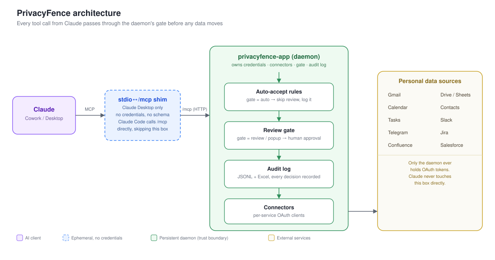

# PrivacyFence Technical Reference

This document contains the detailed operational and implementation reference for PrivacyFence.

For the product overview, governance model, screenshots, supported systems, and quick start, see the project [README](../README.md).

## Contents

- [Review model](#review-model)
- [Connectors & privacy matrix](#connectors--privacy-matrix)
- [Auto-accept grants](#auto-accept-grants)
- [Auto-accept rules](#auto-accept-rules)
- [Always-allow suggestion candidates](#always-allow-suggestion-candidates)
- [Always allow for writes](#always-allow-for-writes)
- [Reading and proposing auto-accept changes from the bridge](#reading-and-proposing-auto-accept-changes-from-the-bridge)
- [Scheduled / unattended Cowork tasks](#scheduled--unattended-cowork-tasks)
- [Audit log](#audit-log)
- [Security, privacy & compliance](#security-privacy--compliance)
- [Installation](#installation)
- [Connecting Claude](#connecting-claude)
- [Building a DMG](#building-a-dmg)
- [Configuration reference](#configuration-reference)
- [Architecture notes](#architecture-notes)
- [License](#license)

## System overview

PrivacyFence uses a two-process architecture:

- **`privacyfence-bridge`** is the ephemeral MCP-facing process. It carries no connector credentials.
- **`privacyfence-app`** is the persistent daemon and authoritative control point. It owns credentials, policies, connectors, approvals, PII detection, and audit logging.



The sections below preserve the complete tool-level and implementation-level behavior.

---

## Review model

Every tool call passes through one of three gate values. `review` and `popup` are both native
macOS popups PrivacyFence shows itself — there is no separate Claude Cowork-side approval step
for either one. What differs between them is direction and button set (see below).

| Gate | Behaviour |
|------|-----------|
| `auto` | Passed through immediately, logged as `auto_accepted` |
| `review` | Native popup approval — read direction (tool → Claude) |
| `popup` | Native popup approval — write direction (Claude → tool) |

### Two flows by direction

> **Note on MCP annotations:** the bridge advertises *every*
> tool — reads and writes alike — to Claude as `readOnlyHint = true` /
> `destructiveHint = false`. This is intentional. See
> [Why every tool is advertised as read-only](#why-every-tool-is-advertised-as-read-only) below.

Both flows below open the same kind of native popup — a summary box plus a scrollable pane with
the full content. The only differences are the button set and, on the read side, the PII scan
layered on top.

**Tool → Claude (reads) — gate `review`**

PrivacyFence opens a native popup with a summary box and a scrollable pane showing the full
content (e.g. the email body) up front, offering:

- **Allow once** — data is returned to Claude
- **Deny** — request is blocked; Claude receives an error
- **Always allow** — when a plausible rule can be derived from the item's attributes, proposes
  (with a second confirmation dialog) a standing [auto-accept rule](#auto-accept-rules) for
  similar future reads

**Claude → Tool (writes / actions) — gate `popup`**

Claude already describes the action it is about to take in the chat. PrivacyFence opens a native
popup showing the full action details with **Allow once** or **Deny** — auto-accepting a write
silently is a materially bigger blast radius than auto-accepting a read, so most write popups have
no **Always allow** at all. 35 tools across 29 operation keys are a narrow, deliberate exception —
each proposing a rule scoped to the one folder/label/calendar/project/space/task-list the call just
touched, never a bare "accept every future write of this type" toggle (`gmail_create_draft`, its two
reply variants, and their three `_with_attachments` counterparts are the sole exception to that). See
[Always allow for writes](#always-allow-for-writes) for the full list and how each rule's value is
derived.

For write operations expected to be called repeatedly against the same file in quick succession —
`drive_sheets_write_range`, `drive_sheets_format_range`, `drive_sheets_insert_dimensions`,
`drive_add_comment`, `drive_docs_edit_content`, and `drive_docs_format_content` — clicking
**Allow once** also auto-accepts further calls of that same operation against that same file for 5
minutes, entirely in memory. There's no separate button for this: the popup just shows a plain
disclosure caption above the buttons for these six operations, since a burst of
API-limitation-driven follow-up calls (e.g. formatting a sheet range by range) is the task the
user is really approving, not a duration to pick up front. Unlike a standing
[auto-accept rule](#auto-accept-rules), it's never written to `settings.yaml` and disappears on
daemon restart — a much smaller commitment than Always allow, appropriate for writes where a
standing rule isn't offered at all.

`drive_sheets_delete_dimensions` is deliberately excluded from that grace window even though it's
called in the same kind of burst `drive_sheets_insert_dimensions` is: unlike every operation above,
it removes cell content (not just its appearance or position) with no undo path through
PrivacyFence, so a 5-minute silent-acceptance window is a bigger commitment than for the others. It
still gets the standing-rule **Always allow** shortcut described in
[Always allow for writes](#always-allow-for-writes), same as any other sandbox-folder write — only
the grace window is withheld.

### PII detection gate

This gate mainly runs on the **`review` (read) direction — tool → Claude.** It exists to catch
personal data flowing from an external source into Claude's context, before you approve
handing it over. It does not run on the `popup` (write) direction in general — Claude → tool —
since a write is normally content Claude itself already generated for an action it described in
chat (e.g. `drive_write_file_content`, `gmail_create_draft`, `slack_send_message`), not external
personal data being newly exposed to it.

**One narrow exception:** `drive_upload_file`. Its payload — an arbitrary local file via
`local_path`, or inline bytes via `content_base64` — can be content Claude never actually read,
unlike every other write tool's drafted text. When that file's extracted content (see
[`text_extraction.py`](../src/privacyfence/text_extraction.py) — plain text, HTML, PDF, DOCX,
PPTX, and XLSX; images are out of scope, no OCR) flags likely personal data, the upload gets the
same real treatment a flagged read does: the second "Are you sure?" confirmation below, and `pii_detected`
recorded in the audit log. Every other popup-gate write is unaffected and keeps the weaker,
informational-only content-flag banner described in
[`approval-window-content-reference.md`](approval-window-content-reference.md).

On top of the normal Allow once/Deny popup, PrivacyFence can scan the message/document/spreadsheet
content shown in every `review` dialog (and, per the exception above, `drive_upload_file`'s content)
for likely personal data across **Hungarian, English, and German** before you approve it — IBANs,
credit card numbers, national identifiers, IP addresses, financial figures, and common
personal-data/salary phrases per language. Email addresses and phone numbers are deliberately
excluded (matching those formats flagged nearly every read popup, since almost every email
signature carries the sender's own). See [`pii-detection-keywords.md`](pii-detection-keywords.md)
for the exact categories, patterns, and the full reasoning behind what is and isn't matched.

When something is flagged on a `review` (read) call:

- The popup is tinted light red and shows a banner naming the categories found.
- After clicking **Allow once** (or **Always allow**), one more explicit **"Are you sure?"** dialog is
  required before the decision takes effect — declining it denies the whole request, the same as
  clicking **Deny** on the original popup.

`drive_upload_file`'s exception only extends the **second** part of that — the forced "Are you
sure?" confirmation, and `pii_detected` in the audit log. Its own first popup is never tinted red:
`approval_window.py`'s red-banner rendering is wired to the review-gate's `pii_categories` only, and
the popup-gate window never receives a value for it regardless of tool, so a flagged upload's first
dialog looks like any other (at most the ordinary amber content-flag banner, if `write_content_flags`
separately matched) — the confirmation dialog is the only visible sign anything was flagged.

This is a local, regex-based heuristic (see `src/privacyfence/pii_detector.py`) — it runs
entirely on-device with no network calls, and it can both miss real PII and flag things that
aren't; treat a hit as "look more carefully," not a guarantee either way. By default it never logs
or stores the matched text itself, only the category labels (e.g. "IBAN (bank account number)") —
those category labels, and whether any were flagged, are recorded in the [audit log](#audit-log).

**One opt-in exception, off by default:** `pii_detection.audit_match_details` in `settings.yaml`
(restart required) turns on a PII-refinement trial capture — meant to be enabled for a bounded
window, then turned back off, not left on indefinitely. With it on, an *approved* request's audit
entry also records the literal matched text for a label/keyword category (e.g. "salary") or a
redacted form for a category whose match is itself the sensitive value (IBAN, credit card number,
national ID/tax numbers, IP address, currency figures — see `pii_detector.py`'s
`describe_match_for_audit()`); a request that wasn't approved (denied, denied unattended, or an
unexpected error) never has the matched text recorded, only a fixed "details hidden" placeholder.
The category-label breakdown itself (`pii_categories` in the audit log, "PII Categories" in the
Excel export) is always recorded regardless of this setting — only the literal/redacted text is
opt-in.

The scan runs before any [auto-accept rule](#auto-accept-rules) is checked and overrides a
matching one: auto-accept rules are scoped to metadata (sender domain, folder, "I am the
organizer"), not content, so a rule that would otherwise pass a request through silently still
routes it to the normal popup — tinted, with the second confirmation — whenever the content itself
contains likely PII. A request that matches a rule *and* has no PII in its content still takes the
silent auto-accept path exactly as before this gate existed.

**Second exception, read-side only: content unchanged since PrivacyFence's own last write.**
Every write tool that changes a file's own content (`drive_write_doc_content`,
`drive_docs_edit_content`, `drive_docs_format_content`, `drive_write_file_content`,
`drive_upload_file`, and every `drive_sheets_*` write tool) records, in memory, the Drive
`modifiedTime` that write left the file at
(`DriveConnector.own_write_revisions` in [`connectors/drive.py`](../src/privacyfence/connectors/drive.py)).
`drive_get_file_content`, `drive_sheets_get_values`, and `drive_download_file` each check their
target file's *current* `modifiedTime` against that record. When it still matches exactly, the PII
gate's forced second confirmation is skipped for that one read — not PII detection itself: the
category labels still feed the audit log's `pii_detected` field, and the ordinary review popup
still appears if no other auto-accept rule matches, just without the red tint or the "Are you
sure?" step. The reasoning: this is Claude reading back content it (or a human, via
`drive_upload_file`) already put there and a human already saw once in that write's own approval
popup, so a second confirmation on every re-read is friction, not an extra safety check. The
moment anything else touches the file — a human collaborator, another app, a different Claude
session — `modifiedTime` moves and the very next read goes through the ordinary PII gate again, no
manual revocation needed. Same lifetime and cross-chat sharing as
[`created_this_session`](#auto-accept-rules) below: it lives in memory only, tied to the daemon
process, and is forgotten on restart.

**Toggle:** enable or disable the whole gate from the settings window's **General** page (**PII
Detection Gate**), or set `pii_detection.enabled: true|false` directly in `config/settings.yaml`.
Enabled by default.

**IP address** and **Financial figures (currency amounts)** can also be toggled off individually,
independent of the gate as a whole — from the same **PII Detection Gate** card on the **General**
page, or via `pii_detection.detect_ip_addresses` / `detect_financial_figures` in
`config/settings.yaml` (both `true` by default); every other category is on whenever the gate
itself is enabled. See
[`pii-detection-keywords.md`](pii-detection-keywords.md#individually-optional-categories) for why
these two specifically get their own toggle.

---

## Connectors & privacy matrix

This section lists preview/details text per tool, grouped by connector. For a cut across *what
Claude already knows from prior auto-approved calls* before it ever reaches a given gated tool —
i.e. how much of a "review" tool's return value is actually new information — see
[`claude-knowledge-boundary.md`](claude-knowledge-boundary.md). For the approval dialog's own
layout and optional sections (AI-visibility checklist, PII banner, etc.), see
[`approval-window-content-reference.md`](approval-window-content-reference.md).

### Gmail

**Auth:** OAuth2

| Tool | Dir | Gate | Preview | Details popup |
|------|-----|------|----------------|---------------|
| `gmail_list_messages` | read | auto | — | — |
| `gmail_list_threads` | read | auto | — | — |
| `gmail_get_message` | read | review | from, recipients, date, subject | Full body text |
| `gmail_get_thread` | read | review | subject, all participants, message count, date range | All messages in thread |
| `gmail_list_message_attachments` | read | auto | — | — |
| `gmail_download_attachment` | read | review | from, subject, attachment name, size, save path | — |
| `gmail_create_draft` | write | popup | — | To, cc, subject, full body (or Markdown source, if `body_markdown` given) |
| `gmail_reply_draft` | write | popup | — | In reply to, to, cc/bcc, full reply body (or Markdown source, if `body_markdown` given) |
| `gmail_reply_all_draft` | write | popup | — | In reply to, to, also-to (expanded participants), cc/bcc, full reply body (or Markdown source, if `body_markdown` given) |
| `gmail_create_draft_with_attachments` | write | popup | — | To, cc, subject, attachment names/sizes, full body (or Markdown source, if `body_markdown` given) |
| `gmail_reply_draft_with_attachments` | write | popup | — | In reply to, to, cc/bcc, attachment names/sizes, full reply body (or Markdown source, if `body_markdown` given) |
| `gmail_reply_all_draft_with_attachments` | write | popup | — | In reply to, to, also-to (expanded participants), cc/bcc, attachment names/sizes, full reply body (or Markdown source, if `body_markdown` given) |
| `gmail_add_label` | write | popup | — | From, subject, label name |
| `gmail_remove_label` | write | popup | — | From, subject, label name |
| `gmail_archive_message` | write | popup | — | From, subject, confirmation that message stays in All Mail |
| `gmail_list_filters` | read | auto | — | — |
| `gmail_list_labels` | read | auto | — | — |
| `gmail_create_filter` | write | popup | — | Criteria, actions |
| `gmail_update_filter` | write | popup | — | Filter ID, criteria, actions, note that this deletes + recreates under a new id |
| `gmail_create_label` | write | popup | — | Label name, note when a parent segment will also be created |

### Google Drive

**Auth:** OAuth2

| Tool | Dir | Gate | Preview | Details popup |
|------|-----|------|----------------|---------------|
| `drive_list_files` | read | auto | — | — |
| `drive_get_file_metadata` | read | auto | — | — |
| `drive_list_folder` | read | auto | — | — |
| `drive_list_shared_drives` | read | auto | — | — |
| `drive_create_blank_file` | write | auto | — | — |
| `drive_get_file_content` | read | review | file name, owner, size, modified date | First ~500 chars of content |
| `drive_download_file` | read | review | file name, owner, size, save path | File name, owner, size, modified date, save path |
| `drive_write_file_content` | write | popup | — | File name, owner, new content (plain text) |
| `drive_upload_file` | write | popup | — | File name, size, destination folder |
| `drive_write_doc_content` | write | popup | — | File name, owner, Markdown preview (headings, bold/italic/strikethrough/underline/code, ==highlight==, links, nested lists, tables rendered as rich formatting in the Google Doc) |
| `drive_docs_edit_content` | write | popup | — | File name, owner; find/replace text goes in the details pane, not the preview |
| `drive_docs_format_content` | write | popup | — | File name, owner, formatting summary; the located text goes in the details pane |
| `drive_move_file` | write | popup | — | File name, from folder → to folder |
| `drive_add_comment` | write | popup | — | File name, full comment text |
| `drive_sheets_create` | write | auto | — | — |
| `drive_sheets_get_metadata` | read | auto | — | — |
| `drive_sheets_get_values` | read | review | spreadsheet name, owner, range | Cell values in the range |
| `drive_sheets_write_range` | write | popup | — | Spreadsheet name, owner, range, values/formulas being written |
| `drive_sheets_add_sheet` | write | popup | — | Spreadsheet name, owner, new tab title/dimensions |
| `drive_sheets_rename_sheet` | write | popup | — | Spreadsheet name, owner, tab id, new title |
| `drive_sheets_format_range` | write | popup | — | Spreadsheet name, owner, range, formatting being applied |
| `drive_sheets_insert_dimensions` | write | popup | — | Spreadsheet name, owner, tab id, rows/columns being inserted |
| `drive_sheets_delete_dimensions` | write | popup | — | Spreadsheet name, owner, tab id, rows/columns being deleted (data-loss warning) |

Google Sheets is not a separate connector — the `drive_sheets_*` tools live on the Drive
connector and reuse its OAuth grant (the Sheets API accepts the same `drive` scope). There is
intentionally no delete-sheet tool: `drive_sheets_rename_sheet` is the sanctioned way to mark a
tab for removal (e.g. rename it to `TO BE DELETED - <original title>`) — you delete it by hand
in the Sheets UI. `drive_sheets_write_range` has no separate "set formula" tool either — a cell
string starting with `=` is evaluated as a formula, exactly like typing it into the Sheets UI.

`drive_docs_edit_content` and `drive_docs_format_content` locate existing text in a Google Doc by
exact match against its plain text (the same representation `drive_get_file_content` returns) —
`find_text` must match exactly one location unless `replace_all` is set, so an ambiguous match
raises rather than guessing which occurrence was meant. Unlike `drive_write_doc_content`, they
touch only the matched span, not the whole document. `drive_sheets_insert_dimensions`/
`drive_sheets_delete_dimensions` insert or remove whole rows/columns (not just cell content) in a
tab, shifting everything after the insertion/deletion point; there is no undo path through
PrivacyFence for a delete.

### Slack

**Auth:** OAuth2 (browser sign-in), user token scope. Sees exactly what you see — no bot to invite. See [slack-setup.md](slack-setup.md).

| Tool | Dir | Gate | Preview | Details popup |
|------|-----|------|----------------|---------------|
| `slack_list_channels` | read | auto | — | — (optional `participant` filter matches channel membership by user id, handle, or display name, comma-separated for multiple; one extra `conversations.members` call per channel, plus one `users.info` call per unresolved member if no needle matches by id alone) |
| `slack_list_dms` | read | auto | — | — (each entry is `id` + the other participant; optional `participant` filter matches by user id, handle, or display name) |
| `slack_list_group_chats` | read | auto | — | — (each entry is `id`, `name`, and resolved `member_ids`/`member_names`; optional `participant` filter matches by user id, handle, or display name, comma-separated to require all of them as members of the same group chat; one extra `conversations.members` call per group chat) |
| `slack_resolve_permalink` | read | auto | — | — (parses a pasted Slack message permalink into `channel_id`/`channel_name`/`ts`/`thread_ts`, ready for `slack_get_channel_history`/`slack_get_thread_replies`; no Slack API call beyond a best-effort channel-name lookup) |
| `slack_refresh_user_cache` | read | auto | — | — (forces an immediate `users.list` re-sync of the on-disk, weekly-refreshed user name/email cache that `slack_get_channel_history`/`slack_get_thread_replies`/`slack_search_messages` use to resolve message authors without a per-message `users.info` call; call after a teammate joins mid-week so they resolve correctly before the next automatic refresh) |
| `slack_refresh_channel_cache` | read | auto | — | — (forces an immediate re-sync of the on-disk, weekly-refreshed channel/DM/group-DM name cache those same read tools use to resolve which conversation a message belongs to without a per-message `conversations.info` call; call after a new channel is created so it resolves by name right away. On a workspace with enough channels that one call can't finish before the calling MCP client's own tool-call timeout, the result's `has_more` flag comes back `true` — call the tool again to resume from where it left off) |
| `slack_get_channel_history` | read | review | channel name, message count, first message (80 chars) | All messages |
| `slack_get_thread_replies` | read | review | channel name, thread starter (80 chars), reply count | All replies |
| `slack_search_messages` | read | review | query and/or participant, result count | All results |
| `slack_create_group_chat` | write | popup | — | Resolved participant names (or raw user ids when unresolvable); returns the new/reopened conversation's `id`, ready for `slack_send_message` |
| `slack_send_message` | write | popup | — | Channel name, full message text (optional `mark_unread=true` leaves the message unread after sending; requires `mark` scope) |

`slack_list_group_chats` only lists group DMs that already exist — there's nothing to list until one
has been opened at least once. To start a brand-new group chat, call `slack_create_group_chat` with
2+ participant user ids (from `slack_list_dms`/`slack_list_group_chats`, or a message's `user_id`
field — it does not resolve email addresses or handles), then pass the returned `id` to
`slack_send_message` as `channel_id`.

`slack_list_channels`/`slack_list_group_chats` both accept the same comma-separated `participant`
matching (user id, handle, or display name; comma-separated to require all of them as members of the
same channel/chat) — the tool to reach for when a lookup is "the group chat/channel with Alice and
Bob", as opposed to `slack_search_messages`'s participant matching below, which is for message
content once the right conversation is already known.

`slack_search_messages` accepts an optional `participant` (user id, handle, or display name;
comma-separated to require a group chat containing all of them) alongside or instead of `query`.
When given, it skips Slack's own search index — whose `from:`/`in:` modifiers need exact handle
syntax and don't reliably index every message — and instead reads the matching DM/group-chat
conversation(s) directly via the same matching `slack_list_dms`/`slack_list_group_chats` use,
optionally narrowed by `query` as a client-side text filter. Prefer `participant` over a
text-only `query` for "messages from Bob" or "messages with Bob and Jane" style lookups.

`slack_resolve_permalink` decodes a message permalink (Slack's "Copy link" on any message) into the
`channel_id`/`ts` (and, for a link to a threaded reply, the thread root's `thread_ts`) that
`slack_get_channel_history`/`slack_get_thread_replies` need — the permalink already carries both, so
this needs no `slack_list_channels`/`slack_search_messages` call at all to resolve a link a human
pasted directly.

`slack_refresh_user_cache`/`slack_refresh_channel_cache` refresh the on-disk snapshots that
`get_user_info`/`resolve_channel_name`/`resolve_is_group_dm` check before falling back to a live,
per-item Slack call — without them, resolving every message author/channel in a `slack_search_messages`
result costs one `users.info` and one `conversations.info` call per unique sender/channel, every time.
Both snapshots refresh automatically about once a week — checked once the IPC server comes up on every
daemon restart (so a snapshot that went stale while the app was closed is caught then, not on whatever
tool call happens to run first), in the background so the refresh can't delay the menu bar icon
appearing, and, in between restarts, lazily on first use once seven days have passed. These two tools
exist purely for the exception: someone new (a hire, a channel) needs to resolve correctly *before* the
next automatic refresh. Neither tool reads any message content; both are auto-approved.
`slack_refresh_channel_cache` specifically bounds each call to a fixed number of `conversations.list`
pages so a large workspace can't run one call past the calling MCP client's own timeout — see the table
above for the `has_more`/resume behavior; the eager background refresh at startup isn't subject to this
bound, since it isn't racing anyone's timeout.

### Google Calendar

**Auth:** OAuth2

| Tool | Dir | Gate | Preview | Details popup |
|------|-----|------|----------------|---------------|
| `calendar_list_calendars` | read | auto | — | — |
| `calendar_list_events` | read | auto | — | — |
| `calendar_get_free_busy` | read | auto | — | — (returns full events when calendar access is available; falls back to busy-slot list otherwise — set `calendar.free_busy_full_event_details: false` in `settings.yaml` to always fall back regardless of access) |
| `calendar_list_rooms` | read | auto | — | — (lists meeting rooms — name, email, building, floor, capacity — from a static directory IT syncs into `org_config.json` via `scripts/sync_room_directory.py`; not a live lookup, so it may be empty until IT has synced one; the Calendar connector's own OAuth client never holds Workspace admin directory access) |
| `calendar_get_event_details` | read | review | title, time, organizer, attendee count | Description, full attendee list, conferencing link, file attachments (e.g. Gemini meeting notes/transcript) |
| `calendar_get_event_visibility` | read | auto | — | — |
| `calendar_create_event` | write | popup | — | Title, time, attendees, description, location, Google Meet flag, room bookings |
| `calendar_update_event` | write | popup | — | Title, time, fields changing (old → new), Google Meet flag, room bookings |
| `calendar_set_event_visibility` | write | popup | — | Event title, calendar, visibility change (old → new) |
| `calendar_create_out_of_office` | write | popup | — | Title, time, fixed "auto-decline new conflicts only" note, decline message |
| `calendar_set_working_location` | write | popup | — | Date, location (office/home), building/label if given |

`calendar_create_out_of_office` and `calendar_set_working_location` are only supported on the
primary calendar (a Google Calendar API restriction) and always create the event there regardless
of any `calendar_id` used elsewhere. The out-of-office auto-decline behavior is fixed to "decline
new conflicting invitations only" — Calendar also supports declining all conflicts or none, but
that isn't exposed here. Working-location presence only offers "office" or "home" (Calendar's third
"custom location" option isn't exposed either).

`calendar_get_event_visibility` returns just the `visibility` field ("default", "public",
"private", or "confidential") without the full attendee/description/attachment fetch
`calendar_get_event_details` does — cheap enough to be auto-approved on its own, the same way
`calendar_list_events` is. `calendar_set_event_visibility` changes only that one field; every other
property of the event is left untouched. There's no separate `calendar_create_event`/
`calendar_update_event` visibility parameter — set it via `calendar_set_event_visibility` after
creating or alongside updating the event.

### Google Contacts

**Auth:** OAuth2

| Tool | Dir | Gate | Preview | Details popup |
|------|-----|------|----------------|---------------|
| `contacts_list` | read | auto | — | — |
| `contacts_search` | read | auto | — | — |
| `contacts_get` | read | auto | — | — |
| `contacts_update` | write | popup | — | Contact name, fields changing (old → new) |
| `contacts_create` | write | popup | — | Name, fields being set |
| `contacts_add_label` | write | popup | — | Contact name, label (creates the label if it doesn't exist) |
| `contacts_remove_label` | write | popup | — | Contact name, label |

Contact deletion is not supported by this connector.

Google's People API blends personally-saved contacts together with Workspace
directory profiles (colleagues) into a single response by default. `contacts_list`,
`contacts_search`, and `contacts_get` each accept a `source` parameter
(`personal`, `directory`, or `both` — default `both`) to split them apart, and
every returned contact carries a `source` field (`personal`, `directory`, `both`
if it's a saved contact who's also a colleague, or `other` for unclassifiable
entries) plus the raw `source_types` it was derived from. `contacts_get` fails
if the fetched resource doesn't match the requested `source`. Directory search
(`contacts_search` with `source="directory"`) is limited to directory profiles
you already have some contact history with — there is no full company-directory
search under this connector's OAuth scope.

### Telegram

**Auth:** Telethon (MTProto). Reads your chats as you, not as a bot.

| Tool | Dir | Gate | Preview | Details popup |
|------|-----|------|----------------|---------------|
| `telegram_list_chats` | read | auto | — | — |
| `telegram_refresh_chat_cache` | read | auto | — | — (forces an immediate `get_dialogs` re-sync of the on-disk, weekly-refreshed chat/group/channel name cache that `telegram_get_messages`/`telegram_search_messages` use to resolve which chat a message belongs to; call after a new chat starts so it resolves by name right away) |
| `telegram_get_messages` | read | review | chat name, message count | All messages |
| `telegram_search_messages` | read | review | query, result count | All results |
| `telegram_send_message` | write | popup | — | Chat name, full message text |

`telegram_refresh_chat_cache` refreshes the on-disk snapshot that `get_chat_name`/`get_messages`/
`search_messages` check before falling back to a bare numeric chat id — without it, any chat not
already primed by a recent `telegram_list_chats` call (in particular, any chat surfaced only via
`telegram_search_messages`, or after a daemon restart) shows up unresolved. The snapshot refreshes
automatically about once a week — same as Slack's directory caches, checked once the IPC server comes
up on every daemon restart, in the background so a large account's re-sync can't delay the menu bar
icon appearing — and, in between restarts, lazily on first use once seven days have passed. This does
mean a daemon restart now connects to Telegram eagerly rather than waiting for the first Telegram tool
call, an accepted tradeoff now that the connection happens off the startup critical path. Reads no
message content; auto-approved.

### Salesforce

**Auth:** OAuth2 (browser sign-in via a Connected App). See [salesforce-setup.md](salesforce-setup.md).

| Tool | Dir | Gate | Preview | Details popup |
|------|-----|------|----------------|---------------|
| `salesforce_list_reports` | read | auto | — | — |
| `salesforce_get_record` | read | review | object type, record name, record ID | All field values |
| `salesforce_run_report` | read | review | report name, report ID | All report rows |
| `salesforce_search` | read | review | search term, object types, result count | One line per match: object type, name, id |

`salesforce_search` is the same mechanism (SOSL) behind the search bar at the top of the
Salesforce UI — search by name or id across one or more object types, optionally scoped to one
Account's related records (`account_id`, requires `object_types` to be set). Results are
lightweight Id/Name matches, not full records — call `salesforce_get_record` for full field
details on a match, the same search-then-drill-in split `jira_search_issues`/`jira_get_issue`
already use.

### Jira

**Auth:** OAuth2 (browser sign-in, Atlassian 3LO). Shared with Confluence — one sign-in covers both. See [atlassian-setup.md](atlassian-setup.md).

| Tool | Dir | Gate | Preview | Details popup |
|------|-----|------|----------------|---------------|
| `jira_list_projects` | read | auto | — | — |
| `jira_search_issues` | read | auto | — | — |
| `jira_get_issue` | read | review | project name, key, summary, status, assignee | Description, comments, all fields |
| `jira_get_transitions` | read | auto | — | — |
| `jira_create_issue` | write | popup | — | Project, type, summary, full description |
| `jira_add_comment` | write | popup | — | Issue key + summary, full comment |
| `jira_update_issue` | write | popup | — | Issue key + summary, fields (old → new), including custom fields |
| `jira_transition_issue` | write | popup | — | Issue key + summary, status (old → new) |

`jira_update_issue`'s `custom_fields` parameter takes a JSON object keyed by each custom field's
**display name** exactly as shown in the Jira UI (e.g. `{"Story Points": 5}`) — never the internal
`customfield_NNNNN` id. The connector resolves the name via Jira's field metadata and shapes the
value for select-list (single- and multi-option) fields automatically; fields needing a structured
reference the name alone can't supply (e.g. a user-picker field, which needs an `accountId`) are
passed through as-is and surface Jira's own validation error if the shape is wrong.
`jira_transition_issue` moves an issue by transition name (e.g. "Done") — call
`jira_get_transitions` first to see which names are valid from the issue's current status.

### Confluence

**Auth:** OAuth2 (browser sign-in, Atlassian 3LO), shared with Jira — one sign-in covers both. See [atlassian-setup.md](atlassian-setup.md).

| Tool | Dir | Gate | Preview | Details popup |
|------|-----|------|----------------|---------------|
| `confluence_list_spaces` | read | auto | — | — |
| `confluence_search` | read | auto | — | — |
| `confluence_cql_search` | read | auto | — | — |
| `confluence_list_pages` | read | auto | — | — |
| `confluence_get_page` | read | review | title, space, author, last modified | Full page body |
| `confluence_get_page_by_title` | read | review | title, space, author, last modified | Full page body |
| `confluence_list_attachments` | read | auto | — | — |
| `confluence_download_attachment` | read | review | title, space, attachment name, type, size, save path | — |
| `confluence_create_page` | write | popup | — | Space, title, parent page, full body |
| `confluence_update_page` | write | popup | — | Title, space, full new body |

### Google Tasks

**Auth:** OAuth2

| Tool | Dir | Gate | Preview | Details popup |
|------|-----|------|----------------|---------------|
| `tasks_list_task_lists` | read | auto | — | — |
| `tasks_list_tasks` | read | auto | — | — |
| `tasks_get_task` | read | auto | — | — |
| `tasks_create_task` | write | popup | — | Task list, title, due date, full notes |
| `tasks_update_task` | write | popup | — | Task list, task, new title/due date, full notes |
| `tasks_complete_task` | write | popup | — | Task list, task |
| `tasks_uncomplete_task` | write | popup | — | Task list, task |
| `tasks_move_task` | write | popup | — | Task, from list, to list |

### Apps Script

**Auth:** OAuth2. Reads/writes script *source* only — PrivacyFence never runs a script. There is
deliberately no execute/run tool: see issue #154's "Non-goals" and `apps_script_client.py`'s
module docstring. The user runs a script themselves in the Apps Script editor (or via its own
triggers), under their own Google account, through Apps Script's own separate consent screen —
untouched by PrivacyFence.

| Tool | Dir | Gate | Preview | Details popup |
|------|-----|------|----------------|---------------|
| `apps_script_list_projects` | read | auto | — | — |
| `apps_script_get_content` | read | review | project name, file count | Full source of every file |
| `apps_script_write_content` | write | popup | — | Project name, file names/types, full new source of every file |
| `apps_script_get_execution_log` | read | review | project name, execution count | Function, status, start time, duration per recent run |

`apps_script_get_execution_log` surfaces the result of a run the **user** triggered outside
PrivacyFence (via the Processes API's `listScriptProcesses`) — status/duration/which function ran,
not a live `console.log` transcript; see `apps_script_client.py`'s module docstring for why.
`apps_script_write_content` always replaces a project's entire file set (there is no
single-file/partial update in the underlying API), the same "show full resulting content, not a
diff" precedent `drive_write_doc_content` set. `apps_script_write_content` has no configurable
auto-accept rule yet — Allow-once-only, like most new write tools at first cut.

---

## Auto-accept grants

Trusting a specific resource — a Drive folder, a Google Tasks list, a Slack channel, a Jira
project, ... — is configured **once per resource**, under `auto_accept_grants` in
`config/settings.yaml`, rather than by adding the same ID to every operation key that resource
happens to touch (see [Auto-accept rules](#auto-accept-rules) below for the older, still-supported
per-operation form). This is also what the settings window's **Auto-accept Rules → \<Connector\> →
Trusted \<Resource\>** sections read and write — editing the YAML directly and editing from that
window are equivalent.

```yaml
auto_accept_grants:
  drive:
    sandbox_folders:
      - id: "1CdeFghIJKLmnoPQRstuVWxyz0123456789AbCdEfGh"
        name: "Claude scratch space"   # cosmetic — see below
        write: true
    folders:
      - id: "1BxiMVs0XRA5nFMdKvBdBZjgmUUqptlbs74OgVE2upms"
        name: "Shared Reports"
        read: true
  tasks:
    task_lists:
      - id: "MDAwMDAwMDAwMDAwMDAwMDAwMDA6MDow"
        name: "Personal"
        create: true
        edit: true
        complete: true
        move: true
```

Each grant entry is keyed by `id` (or `key` for Jira/Confluence, which already address resources
that way) plus a small set of capability booleans. A freshly added grant starts with every
capability `false` — adding a resource does nothing until a capability is explicitly turned on,
from the settings window or by hand. `name` is a cosmetic cache of the resource's last-resolved
display name; the evaluator never reads it, only `id`/`key` and the capability booleans decide what
auto-accepts.

### What each resource type covers

| Connector | Resource type (`config_key`) | Capabilities → what they auto-accept |
|---|---|---|
| `drive` | `folders` | `read` → reading file contents/downloads in that folder, and `sheets.read_values` for spreadsheets in it |
| `drive` | `sandbox_folders` | `write` → writing files/Docs in that folder (including `docs.edit_content`/`docs.format_content`), every `sheets.*` write operation for spreadsheets in it, commenting on a file already there, uploading into it, and moving a file out of it |
| `tasks` | `task_lists` | `create`, `edit`, `complete` (covers complete + uncomplete), `move` — one per Tasks write tool |
| `slack` | `channels` | `read` → reading channel/thread history and search results in that channel; `send` → sending messages there |
| `telegram` | `chats` | `read` → reading/searching that chat; `send` → sending messages there |
| `jira` | `projects` (by `key`) | `read`, `create`, `comment`, `update`, `transition` — one per Jira tool |
| `confluence` | `spaces` (by `key`) | `read` → reading a page or downloading its attachments in that space, `create`, `update` |
| `calendar` | `calendars` | `read` → reading event details on that calendar; `write` → creating/updating events there |
| `salesforce` | `reports` | `run` → running that specific report |

`drive.upload_file`'s destination-folder allowlist (`parent_folder_allowlist`) and
`drive.move_file`'s move-approval (`move_within_approved_folders`) are targets of the
`sandbox_folders` grant's `write` capability too, alongside the rest — one trusted sandbox folder
now covers writing into it, uploading into it, and moving a file out of it, not only writing to a
file already there. They use their own rule names rather than `approved_sandbox_folder` since their
underlying checks differ (a destination-folder arg for uploads; the file's current parent folder,
not the move's destination, for moves — see [Auto-accept rules](#auto-accept-rules) below), but take
the same plain folder-id-list value the grant already compiles.

### Settings window UX

On the settings window's **Auto-accept Rules** page, selecting a connector shows each resource type
above as its own **Trusted \<Resource\>** section: every currently-granted resource is its own row,
with a **Name** field and a **Resource ID** field (plain text inputs, committed on blur/Enter —
pasting a Drive/Sheets URL into a Drive folder's ID field extracts the ID automatically; every other
connector's ID field takes the raw ID/key as typed), one toggle (rendered as a chip) per capability,
and its own **✕ Remove**. Once an ID is entered and the connector is authenticated, its display name
is resolved in the background and shown in the Name field (see [Name resolution](#name-resolution)
below). Adding one is a single **+ Add \<resource\>…** action that appends a blank row to fill in by
hand — an earlier menu-bar version of this page had a native "pick from a list of everything visible
to this connector" picker for connectors with a cheap listing call; this pass's settings window
dropped that in favor of the same manual Name/Resource-ID entry for every connector.

Every existing rule under `auto_accept_rules` that isn't a resource grant (domain trust, label
matching, file-type allowlists, and similar — see [Auto-accept rules](#auto-accept-rules)) lives on
that same connector's page as a `rule_type` / `value` row. `rule_type` is a dropdown listing only
the rule names that operation actually supports (`RULES_BY_OPERATION` in settings_controller.py),
committed immediately on selection rather than requiring the rule name to be typed by hand; `value`
stays a plain text field, committed on blur/Enter. A list-valued rule's `value` field takes a
comma-separated list directly (e.g. `domain1.com, domain2.com`) in one field, rather than an earlier
menu-bar version's one-value-at-a-time **+ Add value…** / **✕ Remove** treatment.

**Sheets** and **Docs** get their own top-level sidebar pages in this window (neither is a real
connector — both ride on Drive's OAuth grant, see [Auto-accept rules](#auto-accept-rules)'s Drive
section), but the `folders`/`sandbox_folders` grants above are Drive-page-only sections — a folder
trusted there silently also covers `sheets.read_values` and every `sheets.*`/`docs.*` write. So
each of those two pages opens with a read-only **Governed by Drive** section summarizing the
currently-granted folder(s) for read/write and a **Manage in Drive →** link that jumps the sidebar
selection there — no checkboxes of its own; the one editable copy of these grants stays on the
Drive page.

### Web surfaces (`/approvals`, `/settings`)

P4 (`docs/https-connector-refactor-plan.md` §16) puts the same settings UX above, and the approval
card, on the web — opt-in, alongside the native windows, not a replacement for them yet (P10 is what
eventually retires those). Two config keys under `web:` in `settings.yaml`:

- `web.approval_ui: web` — P1's own lever, unchanged: approvals render at `/approvals` instead of a
  native dialog.
- `web.settings.enabled: true` — turns on `GET /settings` and its `POST /api/settings/{action}`
  dispatcher, independent of the lever above (a deployment can mix native approvals with the web
  settings page, or the reverse). `web.settings.allow_quit` (default `true`) gates whether the About
  page's Quit button works from a browser at all — always behind an in-page confirmation either way.

Both pages, when enabled, share one origin, one session (the same local `web_token` §10 of the
refactor plan already describes), and one shared chrome (`web_shell.py`): a header with Approvals/
Settings navigation and a live-connection indicator bound to `GET /api/state/stream` — one SSE
channel carrying both a `settings` event (`SettingsController.snapshot()`, pushed the moment
something changes it from anywhere — a rule edited over MCP, a background OAuth flow finishing) and
an `approvals` event (the pending-approval list), so an open tab never needs a manual refresh.

`/settings`'s own action dispatcher is an **explicit allowlist**, not the native window's
`getattr(controller, action)` — an unlisted or misspelled action name is a 404 before any lookup
happens at all, and every argument is validated against the controller method's own type
annotations (a bad `idx` is a 400, not a 500). Four actions that don't fit "POST an action, get a
snapshot back" get their own routes instead: uploading an organization config bundle (multipart,
JSON/`version`-validated, written `0600`), downloading the current week's audit log export
(`Content-Disposition: attachment`), an in-page "update available" banner (Download/Remind Me
Later/Skip, replacing a native alert), and the repo link (a plain `<a href>`, opened client-side —
never a `subprocess.run(["open", ...])` reachable from an HTTP request, which nothing under `web/`
does at all, by design).

The General page's **Connect Claude** card (P4c, `docs/https-connector-refactor-plan.md` §16.9 —
supersedes the reverted P4b/D11 Desktop stdio shim, see the [`claude mcp add`](#connecting-claude)
section above) shows the `/mcp` URL and a ready-to-paste `claude mcp add` command whenever
`web.mcp.enabled` is on. The bearer token itself is never in the page's initial state — one more
action, `reveal_mcp_token`, goes through the same allowlisted dispatcher as everything else but
answers with a bare `{"mcp_token": ...}` rather than a fresh snapshot; both bridges (this page's JS
and the native settings window's) route that specific response to its own `window.__pfRevealMcpToken`
callback instead of the generic re-render, so revealing the token can't stomp on the rest of the
rendered page.

The `/approvals` list (`docs/approval-list-ui-ux.md`) shows every currently-pending card as its own
row — connector icon, title, a relative timestamp, a **Deny** button right on the row, and a
**Review →** link to the full card at `/approvals/{id}`. There is deliberately no **Allow** on the
row: denying without reading the card can't leak anything, and putting an "Allow" button on a
one-line summary is exactly the habituation failure the full card exists to prevent. Deciding a card
navigates back to the list (not a dead "close this tab" page) with a toast saying what happened,
including the 409 case where a rule created elsewhere already resolved it first.

Desktop notifications (`web.notifications.enabled`, default `true`) are tier 0/1 only — a title-bar
`(N)` badge and an `aria-live` announcement need no permission at all; `registration.showNotification
()` (via `resources/sw.js`, a service worker with no `push` handler and no cache) fires while a tab
is open but unfocused, after the browser's own permission prompt, itself only ever offered once,
right after a person's first decision (never on page load). The notification body is always the bare
pending count — never a connector, tool, or row title, several of which can carry real gated content
(an event title, a contact name) — until a real per-field allowlist for the richer `standard`/
`detailed` levels ships. Push notifications for a closed tab (tier 2) are `org`-mode work, not built
yet.

### Name resolution

Grant rows show the resource's real name, resolved via the same connector API calls used
elsewhere in the daemon (e.g. `drive_get_file_metadata`, `tasks_list_task_lists`), cached
in-memory (short TTL) and on disk (`resource_name_cache.json` next to the rest of PrivacyFence's
data) so a name is available immediately even before a connector has reconnected this session.
Resolution never blocks or changes an auto-accept decision — a row falls back to the ID itself,
annotated "(resolving…)" or "(connect \<Connector\> to see its name)", if a name isn't available
yet or the connector isn't currently authenticated.

### Relationship to `auto_accept_rules`

`auto_accept_grants` and `auto_accept_rules` are both read every time rules are (re)loaded — a
grant's enabled capabilities compile into the exact same `{rule, value}` shape a hand-written entry
under `auto_accept_rules` already used, so the evaluator itself has no separate code path for
grants. Existing hand-written `auto_accept_rules` entries keep working unmodified.

On first startup after upgrading to a version with this feature, PrivacyFence looks for
`auto_accept_rules` entries that exactly match what a grant's capability would already produce —
i.e. the same rule value repeated identically across *every* operation key that capability covers
— and folds those into `auto_accept_grants` automatically, removing the now-redundant
`auto_accept_rules` entries. This runs once (tracked by a `migrated_to_grants_v1` marker) and is
logged at `INFO` level. A **partial** match (the value present on some but not all of a
capability's operation keys) is deliberately left alone rather than migrated, since folding it in
would silently widen auto-accept to operation keys never explicitly configured — those stay under
`auto_accept_rules`, visible and removable from the connector's page in the settings window, but no
longer offered as something "+ Add rule…" creates fresh (steering new configuration toward the
grants model without breaking what's already there).

---

## Auto-accept rules

Beyond the connector/resource-scoped [grants](#auto-accept-grants) above, routine, low-risk
requests can also be approved automatically based on an *attribute* of the request rather than a
specific resource's identity — sender domain, label, file type, and similar, where there's no
single resource ID to grant trust to once. These stay configured per operation in
`config/settings.yaml` under `auto_accept_rules`. When a rule matches, the gate is bypassed and the
request is logged as `auto_accepted`.

### Available rules

**Gmail**

| Rule | Matches when… |
|------|--------------|
| `i_am_sender` | The authenticated account is the sender |
| `i_am_sole_recipient` | The only recipient is the authenticated account |
| `trusted_sender_domain` | Sender's domain is in the allowlist, including subdomains (e.g. `mail.trusted.com` matches an allowlisted `trusted.com`) |
| `label_match` | Message carries one of the specified labels |
| `age_threshold_days` | Message is older than N days |
| `no_attachments` | Message has no attachments |

These apply to Gmail's read tools. Gmail's write tools (`gmail_create_draft`, `gmail_reply_draft`,
`gmail_reply_all_draft` and their `_with_attachments` counterparts, `gmail_add_label`,
`gmail_remove_label`, `gmail_create_label`) have their own rules:

| Rule | Matches when… |
|------|--------------|
| `to_is_myself` | Every recipient of the draft/reply is the authenticated account itself |
| `approved_recipient_domain` | Every recipient's domain is in the allowlist |
| `label_name_allowlist` | The label being added/removed/created is in the allowlist |
| `always_allow` | Unconditional — matches every call, regardless of recipient |

`always_allow` (`gmail.create_draft` only, of these three) is deliberately broader than
`to_is_myself`/`approved_recipient_domain`: a draft never sends itself, so "always auto-accept
drafting, I review before it sends anyway" is a coherent policy independent of who the draft is
addressed to. It's the same value-less rule shape as `i_am_owner`/`dm_with_myself` — presence under
an operation key is the whole condition — see [Google Calendar](#google-calendar) below for its
other two uses.

`gmail_create_filter` and `gmail_update_filter` have no built-in rule and always prompt — a
filter's criteria/action combination is too open-ended for a simple allowlist match.

**Google Drive**

| Rule | Matches when… |
|------|--------------|
| `i_am_owner` / `created_by_me` | Authenticated account owns the file |
| `approved_folder` | File is in an approved folder (by Drive folder ID) |
| `approved_sandbox_folder` | File is in an approved sandbox folder |
| `move_within_approved_folders` | Move operation stays within approved folders |
| `file_type_allowlist` | File MIME type is in the allowlist |
| `created_this_session` | File was created by Claude in the current session |
| `shared_drive_exclusion` | File is NOT on a shared drive |

`drive_upload_file` additionally supports `parent_folder_allowlist` (matches when the upload's
destination folder ID is in the allowlist).

> **`approved_folder`, `approved_sandbox_folder`, `parent_folder_allowlist`, and
> `move_within_approved_folders` are all grant-managed** — see
> [Auto-accept grants](#auto-accept-grants) → `drive.folders` / `drive.sandbox_folders`. Add the
> folder there once (from the settings window's **Trusted Folders** / **Sandbox Folders** sections
> under **Auto-accept Rules → Drive**, or by hand under `auto_accept_grants`) and it applies across
> every operation key below automatically, instead of needing the same folder ID added to each one
> separately — including
> `drive_upload_file`'s destination-folder check and `drive_move_file`'s move-approval, which use
> their own rule names (different underlying check — see below) but the same sandbox-folder grant.

The same rules apply to the `drive_sheets_*` tools, under their own operation keys so they can be
configured independently of plain-file Drive operations: `sheets.read_values` (`i_am_owner`,
`created_by_me`, `approved_folder`, `created_this_session`, `shared_drive_exclusion`) and
`sheets.write_range` / `sheets.add_sheet` / `sheets.rename_sheet` / `sheets.format_range` /
`sheets.insert_dimensions` / `sheets.delete_dimensions`
(`i_am_owner`, `approved_sandbox_folder`, `created_this_session`). A spreadsheet is a Drive file,
so e.g. `created_this_session` fires for a spreadsheet `drive_sheets_create` made earlier in the
same conversation. `approved_folder`/`approved_sandbox_folder` on these seven operation keys
(`sheets.read_values` plus the six `sheets.*` writes) are the same grant-managed rules as above —
one `drive.folders`/`drive.sandbox_folders` grant covers all of plain Drive reads/writes and every
one of these `sheets.*` operations at once, instead of needing the same folder ID added to each one
separately (the old, still-fully-supported way — configure each rule independently under
`auto_accept_rules`, as before grants existed).

Clicking **Always allow** on a "Read Sheet Values" prompt proposes the same `i_am_owner`/
`approved_folder` candidate(s) as `drive.read_file_contents`/`download_file` — see
[Always-allow suggestion candidates](#always-allow-suggestion-candidates) below for how the popup
renders one button per candidate when both apply.

`drive.comment_file` (`drive_add_comment` — also used for comments on Docs and Sheets, since those
ride the Drive connector's OAuth grant) supports `i_am_owner`, `approved_sandbox_folder`, and
`created_this_session` the same way plain Drive files do. `docs.edit_content` and
`docs.format_content` (`drive_docs_edit_content`/`drive_docs_format_content`) support the same rules
`drive.write_doc` does — `i_am_owner`, `approved_sandbox_folder`, `created_this_session` — under
their own operation keys. `approved_sandbox_folder` here is the same `drive.sandbox_folders` grant
covered above — enabling its `write` capability auto-accepts `drive.comment_file`,
`docs.edit_content`/`docs.format_content`, `drive.upload_file`, and `drive.move_file` too, alongside
`drive.write_file`/`drive.write_doc` and every `sheets.*` write.

**Every one of Drive's write ops offers Always allow** — see
[Always allow for writes](#always-allow-for-writes) below for the full table; most propose
`approved_sandbox_folder` from the file's current parent folder(s), `drive.upload_file` proposes
`parent_folder_allowlist` from the upload's destination folder, and `drive.move_file` proposes
`move_within_approved_folders` from the file's folder *before* the move. Some also still get a
temp-accept grace window on top (see [Review model](#review-model)'s "Claude → Tool" section).
`sheets.write_range`, `sheets.format_range`,
`sheets.insert_dimensions`, `drive.comment_file`, `docs.edit_content`, and `docs.format_content`
are the exception: clicking Allow once on one of these also arms an in-memory, non-persisted
acceptance scoped to one spreadsheet/file for 5 minutes — disclosed in the popup with a plain
caption, not a separate button — see [Two flows by direction](#two-flows-by-direction).
`sheets.add_sheet` and `sheets.rename_sheet`
get neither; they're one-shot per file rather than something called repeatedly in a burst, so a
standing rule (configured as above) is the only way to skip their popup. `sheets.delete_dimensions`
also deliberately gets neither, despite being called in the same kind of burst
`sheets.insert_dimensions` is: unlike insert/format, deleting rows or columns removes cell content
with no undo path through PrivacyFence, so it only ever gets the standing-rule treatment — see
[Two flows by direction](#two-flows-by-direction) for the reasoning.

**Slack**

| Rule | Matches when… |
|------|--------------|
| `dm_with_myself` / `send_to_myself` | Target channel is a self-DM |
| `group_dm` | Target channel is a group DM (Slack's "mpim" type — a private multi-person conversation, distinct from a 1:1 DM and from a private channel) |
| `approved_channel` / `approved_recipient` | Channel ID is in the allowlist |
| `approved_channel_all_results` | **Every** message returned is from a channel in the allowlist |
| `public_channels_only` | All messages are from public channels |
| `no_file_attachments` | Messages have no file attachments |
| `reply_in_existing_thread` | Message is a reply (has `thread_ts`) |

`group_dm` recognizes the group-DM *shape* itself as a trustable category, rather than requiring
each group's channel ID to be individually allowlisted under `approved_channel` the way a regular
channel is. Channel type isn't derivable from the ID alone (a private channel can share the same
`G`-prefixed shape a group DM uses), so `slack_get_channel_history`/
`slack_get_thread_replies` resolve it via `SlackClient.resolve_is_group_dm()` (a cached
`conversations.info` lookup) before the call reaches the gate, alongside the channel-name lookup
`slack.py`'s preview text already does.

> **`approved_channel`/`approved_recipient` are grant-managed** — see
> [Auto-accept grants](#auto-accept-grants) → `slack.channels`. One channel grant's `read`/`send`
> capabilities cover both rules above.

`approved_channel` reads a single `channel_id` out of the call's own arguments, which
`slack_get_channel_history`/`slack_get_thread_replies` always provide but `slack_search_messages`
never does — a search can match messages across any number of channels, so there's no one channel
to check against the allowlist. `approved_channel_all_results` is the counterpart for that case: it
reads every message actually returned and only matches when **all** of them are on the allowlist,
gating the whole search if even one result isn't. Configuring it (or `approved_channel`, since both
share `slack.read_messages`) once covers reads, thread reads, *and* searches of the approved
channel(s) alike.

**Google Calendar**

| Rule | Matches when… |
|------|--------------|
| `i_am_organizer` | Authenticated account is the event organizer |
| `no_external_attendees` | All attendees share the same email domain |
| `personal_calendar` | Event is from a specified calendar ID |
| `past_event` | Event end time is in the past |
| `time_window_days` | Event starts within the next N days |
| `no_conferencing_link` | Event has no video conferencing link |
| `non_private_event` | The event's visibility is not `private` |
| `always_allow` | Unconditional — `calendar.out_of_office`/`calendar.working_location` only (see below) |

> **`personal_calendar` is grant-managed** — see [Auto-accept grants](#auto-accept-grants) →
> `calendar.calendars`. One calendar grant's `read`/`write` capabilities cover
> `calendar.read_event_details`, `calendar.create_modify_event`, and `calendar.set_visibility`.

`calendar_create_out_of_office` (`calendar.out_of_office`) and `calendar_set_working_location`
(`calendar.working_location`) each have their own operation key, but none of the rules above apply
to either — both always act on your own primary calendar with no organizer/attendee/other-calendar
concept for these rules to check. Like `gmail.create_draft` above, their only configurable
auto-accept is the unconditional `always_allow` — there's no narrower resource identity to scope a
rule to, so it's a plain yes/no rather than the organizer/calendar-scoped rules
`calendar_create_event`/`calendar_update_event` support.

`calendar_set_event_visibility` (`calendar.set_visibility`) is a write like
`calendar_create_event`/`calendar_update_event`, so it shares `calendar.create_modify_event`'s
rule set (`i_am_organizer`, `no_external_attendees`, `personal_calendar`) rather than getting a
rule of its own — `non_private_event` only applies to `calendar.read_event_details`. Clicking
**Always allow** on a "Read Calendar Event" prompt proposes `non_private_event` when the event
isn't private and neither `i_am_organizer` nor `no_external_attendees` apply.

**Salesforce**

| Rule | Matches when… |
|------|--------------|
| `approved_object_types` | Object type (Account, Contact, …) is in the allowlist — for `salesforce_search` (`salesforce.search`), every object type in its comma-separated `object_types` must be on the allowlist, not just one |
| `approved_report_ids` | Report ID is in the approved list |

> **`approved_report_ids` is grant-managed** — see [Auto-accept grants](#auto-accept-grants) →
> `salesforce.reports`. `approved_object_types` is a small fixed vocabulary (not a resource
> identity) and stays a plain rule.

`salesforce_search` with no `object_types` given reaches Salesforce's whole default set of
globally-searchable objects — too broad for `approved_object_types` to ever match, so an unscoped
search always prompts (or needs a differently-shaped rule, none of which exist yet).

**Google Contacts**

| Rule | Matches when… |
|------|--------------|
| `no_contact_info_change` | The update doesn't touch `emails` or `phones` (name/organization/notes-only edits) |

**Jira**

| Rule | Matches when… |
|------|--------------|
| `i_am_reporter` | Authenticated account is the issue's reporter |
| `i_am_assignee` | Authenticated account is the issue's assignee |
| `approved_project_keys` | Issue's project key is in the allowlist |

`jira_transition_issue` (`jira.transition_issue`) also accepts `approved_project_keys` — it derives
the project from `issue_key` the same way `jira_get_issue`/`jira_update_issue` do. `i_am_reporter` /
`i_am_assignee` don't apply to it, since a transition call doesn't carry the issue's reporter/assignee.

> **`approved_project_keys` is grant-managed** — see [Auto-accept grants](#auto-accept-grants) →
> `jira.projects`. One project grant's `read`/`create`/`comment`/`update`/`transition`
> capabilities cover all five rules above at once, instead of adding the same project key
> separately to `jira.read_issue`, `jira.create_issue`, `jira.add_comment`, `jira.update_issue`,
> and `jira.transition_issue`.

**Confluence**

| Rule | Matches when… |
|------|--------------|
| `i_am_author` | Authenticated account is the page's author |
| `approved_space_keys` | Page's space key is in the allowlist |

> **`approved_space_keys` is grant-managed** — see [Auto-accept grants](#auto-accept-grants) →
> `confluence.spaces`. One space grant's `read`/`create`/`update` capabilities cover
> `confluence.read_page`/`confluence.download_attachment`, `confluence.create_page`, and
> `confluence.update_page` at once.

**Telegram**

| Rule | Matches when… |
|------|--------------|
| `approved_chats` | Chat ID is in the allowlist |
| `approved_chats_all_results` | **Every** message returned is from a chat in the allowlist |
| `no_media_attachments` | Messages have no media attachments |

> **`approved_chats` is grant-managed** — see [Auto-accept grants](#auto-accept-grants) →
> `telegram.chats`. One chat grant's `read`/`send` capabilities cover both
> `telegram.read_chat_messages` and `telegram.send_message`.

`telegram_search_messages` shares the `telegram.read_chat_messages` operation key with
`telegram_get_messages` (an upgrade from an older release with a separate `telegram.search_messages`
key migrates any existing rules onto the shared key automatically, see
`auto_accept.migrate_telegram_search_operation_key()`), the same way `slack_search_messages`
already shares `slack.read_messages`. `approved_chats` reads a single `chat_id` out of the call's
arguments, which a search never provides (it can match across any number of chats); configuring it
also covers `approved_chats_all_results`, the counterpart evaluated against every result a search
actually returns, matching only when **all** of them are on the allowlist.

**Google Tasks**

| Rule | Matches when… |
|------|--------------|
| `approved_task_list` | Task list is in the allowlist — for `tasks_move_task`, both the source and destination list must be |

`approved_task_list` applies independently to each of `tasks.create_task`, `tasks.update_task`,
`tasks.complete_task`, `tasks.uncomplete_task`, and `tasks.move_task`, so you can e.g. auto-accept
edits within a personal list while still requiring review for creates.

> **`approved_task_list` is grant-managed** — see [Auto-accept grants](#auto-accept-grants) →
> `tasks.task_lists`. One task-list grant's `create`/`edit`/`complete`/`move` capabilities cover
> all five task-write operations at once (`complete` covers both complete and uncomplete).

> **Google Contacts**: `contacts_list`, `contacts_search`, and `contacts_get` are unconditionally auto-accepted. `contacts_update`, `contacts_create`, `contacts_add_label`, and `contacts_remove_label` are all `popup`-gated; `no_contact_info_change` above is the only configurable auto-accept rule, and it applies only to `contacts_update`. Contact deletion is not supported. **Google Tasks**: all three read tools plus `tasks_list_task_lists` are unconditionally auto-accepted; the five write tools (`tasks_create_task`, `tasks_update_task`, `tasks_complete_task`, `tasks_uncomplete_task`, `tasks_move_task`) are `popup`-gated, each independently configurable via `approved_task_list` above. **Telegram**: `telegram_list_chats` is unconditionally auto-accepted; `telegram_get_messages` and `telegram_search_messages` are `review`-gated by default but configurable via the rules above (sharing one operation key, `telegram.read_chat_messages`); `telegram_send_message` is `popup`-gated with no configurable rule. **Jira and Confluence** read tools (`jira_get_issue`, `confluence_get_page`, `confluence_get_page_by_title`, `confluence_download_attachment`) are `review`-gated by default but configurable via the rules above; their write tools remain `popup`-gated with no configurable rule, except `jira_transition_issue`, which accepts `approved_project_keys` as noted above. **Apps Script**: `apps_script_list_projects` is unconditionally auto-accepted; `apps_script_get_content` and `apps_script_get_execution_log` are `review`-gated with no configurable rule; `apps_script_write_content` is `popup`-gated with no configurable rule (Allow-once-only at first cut — see issue #154 open question 2).

---

## Always-allow suggestion candidates

Four operations can produce more than one plausible "Always allow" suggestion at once — e.g. a
Drive read where you both own the file *and* it's in an approved folder. Rather than picking one
to propose, the popup renders **one "Always allow" button per matching candidate**:

| Family (`auto_accept.SUGGESTION_FAMILIES`) | Operations | Candidates, in fixed declaration order |
|---|---|---|
| `drive_read` | `drive.read_file_contents`, `drive.download_file` | `i_am_owner`, `approved_folder` |
| `calendar_read_event` | `calendar.read_event_details` | `i_am_organizer`, `no_external_attendees`, `non_private_event` |
| `jira_read_issue` | `jira.read_issue` | `i_am_reporter`, `i_am_assignee`, `approved_project_keys` |
| `confluence_read_page` | `confluence.read_page`, `confluence.download_attachment` | `i_am_author`, `approved_space_keys` |

`suggest_rule_choices()` (`auto_accept.py`) returns every candidate that actually matches the item
on screen, walked in the fixed declaration order above — not a single top-priority pick, and not
configurable (there used to be a `rule_suggestion_priority` `settings.yaml` key controlling this;
it's gone, since once every match gets its own button there's nothing left to prioritize or
exclude — a pre-existing `rule_suggestion_priority` block in an older `settings.yaml` still loads
without error, it's just logged and ignored). An item matching only one candidate still shows
exactly one button, identical to every other single-candidate operation. An item matching 2+
candidates shows one button per match, in their own
row above Deny/Allow once — clicking any one of them goes straight to that rule's own
confirmation dialog (`show_rule_confirmation_popup()`), the same two-click safety margin every
other Always-allow button gets; there is no separate "choose from list" dialog. Cancelling that
confirmation accepts the item once without creating any rule, same as the single-candidate case.

This affects only what the popup's Always-allow buttons *propose* — it has no effect on which
already-configured `auto_accept_rules`/`auto_accept_grants` entries actually auto-accept a call.
`suggest_rule_choices()` is outside `should_auto_accept()`'s and `preflight_from_args()`'s call
graph, and this feature introduces no new rule names, so it needs no `ARGS_ONLY_RULES`/
`DATA_DEPENDENT_RULES`/`known_rule_names()` changes.

---

## Always allow for writes

Most write popups still don't offer Always allow as a rule — auto-accepting a write silently is a
materially bigger blast radius than auto-accepting a read (see [Review model](#review-model)). The
operations below are a deliberate, narrow set of exceptions, declared in
`auto_accept.WRITE_RULE_SUGGESTIONS`:

| Operation key | Rule proposed | Value derived from |
|---|---|---|
| `gmail.create_draft` | `always_allow` | nothing — unconditional (see below) |
| `gmail.add_label` / `gmail.remove_label` | `label_name_allowlist` | the label just added/removed |
| `calendar.create_modify_event` / `calendar.set_visibility` | `personal_calendar` | the event's own `calendar_id` |
| `drive.write_file` / `write_doc` / `comment_file` | `approved_sandbox_folder` | the file's current parent folder(s) |
| `drive.upload_file` | `parent_folder_allowlist` | the upload's own destination `parent_folder_id` |
| `drive.move_file` | `move_within_approved_folders` | the file's parent folder(s) **before** the move (not the destination) |
| `sheets.write_range` / `add_sheet` / `rename_sheet` / `format_range` / `insert_dimensions` / `delete_dimensions` | `approved_sandbox_folder` | the spreadsheet's current parent folder(s) |
| `docs.edit_content` / `format_content` | `approved_sandbox_folder` | the doc's current parent folder(s) |
| `jira.create_issue` / `add_comment` / `update_issue` / `transition_issue` | `approved_project_keys` | `project_key` if given, else parsed from `issue_key`'s `"PROJ-123"` prefix |
| `confluence.create_page` / `update_page` | `approved_space_keys` | the page's own `space_key` |
| `tasks.create_task` / `update_task` / `complete_task` / `uncomplete_task` / `move_task` | `approved_task_list` | the task's own `task_list_id` (`move_task`: **both** `source_list_id` and `destination_list_id`) |

Every entry except `gmail.create_draft` is resource-identity-scoped — one folder, one label, one
calendar, one project, one space, one task list — never a bare "accept every future write of this
type" toggle; that property is what keeps this exception narrow rather than reopening the
no-Always-allow policy across the board. `gmail.create_draft` is a deliberate exception to that
exception: drafting has no recipient sent yet, unlike `gmail.send_message` (which stays out of this
table entirely and is still reviewed via `to_is_myself`/`approved_recipient_domain` before it goes
out), so an unconditional rule for drafting alone doesn't carry the blast radius a bare toggle would
for an operation that actually delivers something. All of these rule names already existed and were
already configurable by hand or via a grant (see
[Auto-accept grants](#auto-accept-grants)/[Auto-accept rules](#auto-accept-rules) above) — this only
adds a popup-time shortcut to create one on the spot, the same second-confirmation-dialog flow
`suggest_rule()`'s Always allow already uses on the read side, reused here via
`describe_rule_change()` (not `describe_rule()`, whose canned templates are read-direction-only
English and would mislabel a write's own confirmation, since these same rule names are shared with
a read operation key too). A value-less rule like `always_allow` shows just "Add auto-accept rule
'always_allow' to 'gmail.create_draft'" — no "= None" — since `WriteRuleSuggestion.value_of` uses a
`_NO_SUGGESTION` sentinel to tell "nothing to suggest" apart from "the value is legitimately None".

`gate.py`'s popup branch computes `suggest_write_rule(operation_key, ctx)` up front, wraps a
non-`None` result into a single-entry `accept_all_choices` list (via `describe_rule_short()`, the
same shape the review branch's multi-entry list uses) — the same `accept_all_choices` parameter
`show_read_popup()` already uses to decide how many buttons to render — and handles a resulting
`"accept_all"` decision (and its `chosen_index`) inside the same `_interact()` closure as the
popup call itself (P3, docs/https-connector-refactor-plan.md §5-§6 — this used to be "the same
`_popup_lock` acquisition"; the lock is gone, but the ordering guarantee it existed for — the rule
confirmation and persistence happen as part of the one interaction, not deferred to some later
observer — is unchanged), mirroring the review branch exactly. Every other write operation
(roughly a dozen tools, e.g. `gmail_archive_message`, `slack_send_message`) gets `None` from
`suggest_write_rule()` by construction — there's no fallback path, so they're structurally
unaffected and their popups are visually unchanged (Deny / Allow once only).

---

## Reading and proposing auto-accept changes from the bridge

`auto_accept_rules`/`auto_accept_grants` are readable/writable from the daemon side — the settings
window's **Auto-accept Rules** page (`settings_controller.py` / `settings_window_html.py`) or the
"Always allow" confirmation described above — and, additionally, from two bridge meta-tools, so
Claude can inspect and propose changes to this config directly:

### `privacyfence_list_auto_accept_rules` — read

```
privacyfence_list_auto_accept_rules(reason) -> {
    "auto_accept_rules": {<operation_key>: [{"rule": <str>, "value": <any>}, ...]},
    "auto_accept_grants": {<connector>: {<config_key>: [{...grant entry...}, ...]}},
}
```

The raw, addressable config sections straight from `settings.yaml` — not the compiled/merged view
the evaluator uses internally — so a caller can identify an existing entry by its exact fields
before proposing a change to it. No popup, no mutation, no external API call; records a lightweight
`rules_listed` audit entry (see [Audit log](#audit-log)) since it discloses the full current rule
set, the same reasoning as `privacyfence_check_policy`'s `policy_check` entry.

### `privacyfence_propose_auto_accept_rule_change` — write, always gated

```
privacyfence_propose_auto_accept_rule_change(target, operation, reason, ...) -> {
    "confirmed": true, "changed": <bool>, "description": "<str>",
}
```

`target` is `"rule"` (an `auto_accept_rules` entry) or `"grant"` (an `auto_accept_grants` entry);
`operation` is `"add"`, `"update"`, or `"remove"`. This is the one write path a bridge connection
has into `settings.yaml`, and there is no way to reach it without a human confirming: every call
blocks on the same native confirmation dialog the "Always allow" button uses
(`show_rule_confirmation_popup`) — even if an identical rule/grant already exists. A decline (or a
call from a connection in an [unattended session](#scheduled--unattended-cowork-tasks)) makes the
call throw rather than return a false-y result, the same "deny == exception" contract every other
gated tool call already follows.

- `target="rule"` fields: `operation_key`, `rule_name`, `value` (required for add/update — often a
  list, matching the shape shown under [Auto-accept rules](#auto-accept-rules)), `old_value`
  (update only — the prior value being replaced; omit to add alongside the existing value instead
  of replacing it).
- `target="grant"` fields: `connector`, `config_key`, `resource_id` (required), `name` (optional
  cosmetic label), `tab` (no current resource type uses this, but the field is supported generically
  should a future one need it), `capabilities` (add/update only — a map of capability key, e.g.
  `"write"`, to `true`/`false`; see the capability tables under
  [Auto-accept grants](#auto-accept-grants) for which keys apply to which resource type).

Applying the change reuses the exact same persistence functions the settings window's editor and
the "Always allow" flow already use (`auto_accept.add_auto_accept_rule`/`remove_auto_accept_rule`,
`resource_grants.apply_grant_upsert`/`apply_grant_removal`), so a bridge-proposed change hot-reloads
the live evaluator the same way. When it actually changes something, it's recorded as one of four
audit decisions — `rule_changed_via_bridge_proposal`, `rule_removed_via_bridge_proposal`,
`grant_changed_via_bridge_proposal`, `grant_removed_via_bridge_proposal` — distinguishable from a
UI-originated change. A confirmed proposal that turns out to be a no-op (e.g. removing a rule/grant
value that was already gone) is `bridge_proposal_no_op` instead — distinct from both a real change
and from a decline, which reuses the existing `rejected` decision rather than a new value.

Motivating example: a user's config can accumulate many individual `sheets.*` operations each
hand-pinned to `approved_sandbox_folder` (see the callout under
[Auto-accept rules](#auto-accept-rules)) when what's actually wanted is one
`auto_accept_grants.drive.sandbox_folders` grant. With these two tools, Claude can list the current
rules, identify the duplicates, and propose removing them and adding the equivalent grant instead —
each step still confirmed by a human, same as if they'd done it by hand in the settings window.

---

## Scheduled / unattended Cowork tasks

A scheduled Claude Cowork Routine can run with nobody at the keyboard. If it calls a `review`- or
`popup`-gated tool that no auto-accept rule covers, the normal behavior — open a native popup and
wait — means the task hangs indefinitely, and since every popup shares one lock, it also blocks
every other approval (including an unrelated interactive one) behind it until someone finds and
answers the dialog. Two additions address this. Design rationale (why a `contextvars`-scoped flag
rather than a connector-level change, why args-only rules are classified by hand rather than
inferred, alternatives considered) lives in code comments at the relevant call sites —
`gate.py`'s `unattended_scope`/`is_unattended`, `auto_accept.py`'s `ARGS_ONLY_RULES`/
`DATA_DEPENDENT_RULES`, and `ipc_server.py`'s `_begin_unattended_session`.

### `privacyfence_check_policy` — preflight

A bridge meta-tool (not backed by any connector) Claude can call before actually calling a gated
tool, to find out whether that specific call would need a human:

```
privacyfence_check_policy(connector, tool, reason, args) -> {
    "gate": "auto" | "review" | "popup",
    "verdict": "auto_accept" | "requires_review" | "unknown",
    "matched_rule": <str | null>,
    "reason": "<str>",
    "pii_gate_may_apply": <bool>,
}
```

`reason` (required, same as every gated tool's — self-reported and unverified, logged as-is, never
treated as fact) is one sentence on why Claude is checking this right now; recorded on the
resulting `policy_check` audit entry, since that entry has no underlying tool call to take a reason
from otherwise.

It never calls a connector, opens a popup, or has any side effect beyond a lightweight
`policy_check` audit entry (see [Audit log](#audit-log)) — safe to call as often as needed while
planning a task. The verdict is only ever as certain as the underlying rule allows:

- `auto_accept` — a rule matched using only the call's arguments (or an active temp-accept grace
  window); the real call will auto-accept identically.
- `requires_review` — every rule configured for this operation only needs arguments, and none
  matched; fetching the real data cannot change that answer.
- `unknown` — at least one configured rule needs the actual fetched item (e.g. `i_am_owner`,
  `trusted_sender_domain`) to decide, which a preflight check can't see in advance.

For `review`-gated (read) tools, `pii_gate_may_apply` is always `true`: the
[PII detection gate](#pii-detection-gate) scans real content and can force a popup even when a
rule matches, and that can never be predicted before the read happens.

### Unattended sessions — fail fast instead of hang

`privacyfence_begin_unattended_session(reason)` / `privacyfence_end_unattended_session(reason)`
(also bridge meta-tools, each with a required `reason` — same self-reported, unverified, one
sentence contract as `privacyfence_check_policy`'s) let Claude mark the current connection as
running a scheduled/unattended task, for as long as that connection stays open. `reason` is
recorded on the resulting `unattended_session_started`/`unattended_session_ended` audit entry —
for calls this session denies without ever showing a popup, it's the only human-legible record of
why the session was unattended in the first place. While marked, any `review`/`popup` call on that connection
that isn't already covered by a matching auto-accept rule is **denied immediately** — audited as
`denied_unattended`, distinct from a human's own `rejected` — instead of opening a popup nobody
will answer. This applies even when a rule matched but the [PII gate](#pii-detection-gate) still
routed the call to a human. Nothing that would auto-accept today stops auto-accepting; this only
changes the failure mode for calls that would otherwise open an unanswered dialog and hold up
every other approval behind it.

**Off by default.** Set in the organization config bundle (`org_config.json`, installed via
"Install/Update Organization Config…" on the settings window's **General** page — see
[scripts/build_org_bundle.py](../scripts/build_org_bundle.py)'s `--enable-unattended-sessions`
flag), not in `settings.yaml`:

```json
{
  "unattended_sessions": { "enabled": true }
}
```

`privacyfence_begin_unattended_session` errors until an administrator opts in — a Claude session
gaining the ability to switch its own connection into fail-fast mode is a deliberate
per-organization choice, not a per-user setting, so it isn't exposed as a settings-window toggle.
The unattended flag is connection-scoped (the bridge is one process per Cowork task) and clears
automatically if the connection drops, so there's no persistent state to clean up.

The tray's own UI does not currently surface how many connections are in this state — the pre-#120
menu bar's top item showed a live count (e.g. "PrivacyFence is running — 1 unattended session
active"), but the two-item tray issue #120 replaced it with (`menu_bar.py`) has no equivalent, and
`SettingsController` doesn't surface the count anywhere in the settings window either as of this
writing — `ipc_server.set_unattended_changed_listener` is still wired up
(`SettingsController._on_unattended_changed`) but its only current effect is triggering a state
re-render of whatever page happens to be open, not displaying the count itself. The underlying
`IPCServer.unattended_session_count()` this would read from still exists and is accurate — only the
display is currently missing.

---

## Audit log

Every decision — accepted, denied, or auto-accepted — is appended to a JSON-lines file in `logs/audit/YYYY-WNN.jsonl`. At startup, any week that has a `.jsonl` file but no `.xlsx` is automatically exported to a formatted Excel workbook with a colour-coded **Decisions** sheet and a **Summary** tab (the latter includes a "By PII category" breakdown when any entry has one). Each entry also records whether the [PII detection gate](#pii-detection-gate) flagged the content and which category label(s) (e.g. "IBAN (bank account number)") — never the matched text itself, unless the opt-in `pii_detection.audit_match_details` trial setting described in that section is turned on, and even then only for an approved request, and only ever in redacted form for a category whose match is itself the sensitive value.

Two decision values relate to [scheduled/unattended tasks](#scheduled--unattended-cowork-tasks):
`denied_unattended` (a call denied without ever prompting, because the connection was in an
unattended session and no auto-accept rule matched — kept distinct from a human's own `rejected`)
and `policy_check` (a `privacyfence_check_policy` preflight call — not a real decision, recorded
for pattern-spotting only). Both get their own row on the Summary sheet and their own colour on
the Decisions sheet.

Six more relate to
[reading/proposing auto-accept changes from the bridge](#reading-and-proposing-auto-accept-changes-from-the-bridge):
`rules_listed` (a `privacyfence_list_auto_accept_rules` call — like `policy_check`, not a real
decision, recorded because it discloses the full current rule set) and, once a
`privacyfence_propose_auto_accept_rule_change` proposal is confirmed,
`rule_changed_via_bridge_proposal` / `rule_removed_via_bridge_proposal` /
`grant_changed_via_bridge_proposal` / `grant_removed_via_bridge_proposal` when it actually changed
something, or `bridge_proposal_no_op` when it didn't (e.g. removing a rule/grant value that was
already gone). A declined proposal reuses the existing `rejected` decision rather than a new value.

See [connector-qa-testing.md](connector-qa-testing.md) for a Claude Cowork prompt that drives every connector's tools end to end against real accounts — the fastest way to catch a gate, auto-accept rule, or connector client that's drifted from what's documented here.

---

## Security, privacy & compliance

For information security, IT, GDPR, and EU AI Act reviewers: see
[security-and-compliance.md](security-and-compliance.md) for the deployment model
(local, not SaaS), IT's connector-level access authority, the human-in-the-loop review model,
data handling, and PrivacyFence's positioning under GDPR and the AI Act.

---

## Installation

PrivacyFence splits configuration into two steps done by two different people:

1. **IT admin, once per organization:** register a cloud app for each service you want (Google,
   Slack, Salesforce, Atlassian) and package the result into one organization config bundle with
   `scripts/build_org_bundle.py`. See the "For IT admins" section of each doc below. Telegram is
   not part of this step — its `api_id`/`api_hash` identify the PrivacyFence app itself, not your
   organization, and are already baked into the release build. If your organization does Workspace
   room/resource booking, there's one more optional, one-time step here: syncing the room directory
   into the bundle from a *second*, admin-scoped Google Cloud project via
   `scripts/sync_room_directory.py` — see "Room directory sync" in
   [google-cloud-setup.md](google-cloud-setup.md).
2. **Every user, from the settings window (tray icon → "Settings…"):** install the bundle
   IT sent you from the **General** page, then click **Authenticate…** on each connector you want
   from the **Connectors** page. Almost everywhere this opens your browser to sign in — Telegram is
   the only connector that instead asks for your phone number and a verification code via its own
   in-window sign-in flow, since MTProto has no browser-OAuth equivalent.

> See [google-cloud-setup.md](google-cloud-setup.md), [slack-setup.md](slack-setup.md), [salesforce-setup.md](salesforce-setup.md), [atlassian-setup.md](atlassian-setup.md), and [telegram-setup.md](telegram-setup.md) for the full walkthroughs.

### From the DMG (recommended)

The DMG carries both halves of PrivacyFence — the daemon and the Claude extension — so this is
the only download you need:

1. Download the latest `PrivacyFence-<version>.dmg` from the [Releases](../../../releases) page.
2. Open the DMG, drag **PrivacyFenceApp.app** to `/Applications`.
3. Launch it. Releases are code-signed and notarized by Apple, so Gatekeeper lets it open
   normally — no quarantine warning, no manual `xattr` step. The menu bar icon appears
   immediately; there's no setup wizard to walk through.
4. To start PrivacyFence automatically at login, install the LaunchAgent once:
   ```bash
   cp com.privacyfence.app.plist ~/Library/LaunchAgents/
   launchctl load ~/Library/LaunchAgents/com.privacyfence.app.plist
   ```
5. From the tray icon, click **Settings…**, then on the **General** page click
   **Install/Update Organization Config…** and select the bundle your IT team sent you.
6. On the **Connectors** page, click **Authenticate…** for each connector you want — this takes
   effect immediately (the daemon's live connector list is hot-reloaded), no quit/reopen needed.
7. Still in the mounted DMG, double-click **PrivacyFence.mcpb** — Claude Desktop installs the
   MCP server for you (Settings → Extensions → Install Extension… happens automatically). The DMG
   also carries **PrivacyFence (Legacy Bridge).mcpb** — install that one instead only if `/mcp`
   isn't working for you (see [Connecting Claude](#connecting-claude) below); the two install side
   by side without conflicting, so it's safe to have both.

### From source

**Requirements:** Python 3.11+, macOS

```bash
git clone https://github.com/andras-tkcs/privacyfence
cd privacyfence
python -m venv .venv && source .venv/bin/activate
pip install -e .
```

Copy the config (privacy policy / auto-accept rules — no secrets live here):

```bash
cp src/privacyfence/resources/settings.yaml.example config/settings.yaml
```

Build (or obtain from IT) an organization config bundle, then authorize each connector you want —
either from the settings window (tray icon → "Settings…" → **Connectors**) once
`privacyfence-app` is running, or headlessly from the CLI. Running
from source (unbundled) keeps all of this — config, `org/`, `credentials/`, logs — inside the repo
folder itself; only a PyInstaller-bundled `.app` uses `~/.privacyfence` instead (see
[dev-vs-live-setup.md](dev-vs-live-setup.md)):

```bash
python3 scripts/build_org_bundle.py --google-client-secret /path/to/client_secret.json -o org_config.json
mkdir -p org && cp org_config.json org/

privacyfence-app --gmail-oauth
privacyfence-app --drive-oauth
privacyfence-app --calendar-oauth
privacyfence-app --contacts-oauth
privacyfence-app --tasks-oauth
privacyfence-app --slack-oauth        # if the bundle has a Slack app
privacyfence-app --salesforce-oauth   # if the bundle has a Salesforce Connected App
privacyfence-app --atlassian-oauth    # if the bundle has an Atlassian OAuth app
privacyfence-app --telegram-setup     # phone+code sign-in (needs PRIVACYFENCE_TELEGRAM_API_ID/API_HASH env vars for a dev build)
```

Start the daemon:

```bash
privacyfence-app
```

---

## Connecting Claude

The daemon and the bridge are built and shipped separately:

- **PrivacyFenceApp.app** (built by `scripts/build_dmg.sh`) — the daemon: owns credentials,
  connectors, the review gate, the audit log, the LaunchAgent, and (`web.mcp.enabled`, on by
  default — see `settings.yaml.example`) the embedded `/mcp` Streamable HTTP endpoint. Install this
  first via the DMG, in every case below.
- **PrivacyFence.mcpb** (built by `scripts/build_mcpb.sh`, from `bridge/`) — just the bridge: a
  small Node/TypeScript MCP server that talks to the daemon over a TCP loopback connection. Install
  this into Claude Desktop.

> A prior draft of this document (P4b, `docs/https-connector-refactor-plan.md` §12's D11) shipped a
> second, thinner `.mcpb` — a stdio-to-`/mcp` transport shim replacing the bridge for Desktop. That
> phase has since been reverted: `PrivacyFence.mcpb` is the bridge again, unconditionally, and there
> is exactly one Desktop extension. P4c (below, §16.9 of the refactor plan) is what replaces D11's
> goal instead — not a second install artifact, but the daemon's own `/settings` page showing the
> `/mcp` URL and token directly, for Claude Code and any other client that already speaks Streamable
> HTTP natively.

### Option A: one-click extension (Claude Desktop)

`PrivacyFence.mcpb` ships inside the DMG alongside `PrivacyFenceApp.app` (see above) — just
double-click it and Claude Desktop installs the MCP server for you, no
`claude_desktop_config.json` editing.

The daemon (PrivacyFenceApp.app) must already be installed and configured first — the extension
only contains the bridge, bundled by esbuild into a single dependency-free `server/bridge.js` with
no node_modules/ and no Python runtime shipped at all (Claude Desktop supplies its own Node
runtime — `server.type = "node"` in `mcpb/manifest.json.tmpl`), which is why it's ~300KB instead
of the daemon's ~185MB.

To build both artifacts yourself:

```bash
pip install pyinstaller
brew install create-dmg
bash scripts/build_dmg.sh
```

(Node + npm must also be on PATH — used to build `bridge/` and to run the `@anthropic-ai/mcpb` CLI
via npx.) This runs `scripts/build_mcpb.sh` as part of assembling the DMG. To build just the
extension on its own (e.g. for a quick local test without a full DMG), run
`bash scripts/build_mcpb.sh` directly — it produces `dist/PrivacyFence-<version>.mcpb`.

### Option B: `/mcp` directly (Claude Code, or other clients with native Streamable HTTP support)

With `web.mcp.enabled` on (the shipped default) and the daemon running, register `/mcp` directly —
no bridge, no extra process. The easiest way to get the exact URL and a ready-to-paste
`Authorization` header is the running daemon's own `/settings` page (General → **Connect Claude**,
P4c — needs `web.settings.enabled` too; see [Web surfaces](#web-surfaces-approvals-settings)), which
shows both live and never requires finding `~/.privacyfence` yourself. By hand, the same values:

```bash
claude mcp add --transport http privacyfence http://localhost:8765/mcp \
  --header "Authorization: Bearer $(cat ~/.privacyfence/mcp_token)"
```

(Port and token: see the daemon's own startup log line, or `config/settings.yaml`'s `web.port` and
`~/.privacyfence/mcp_token` directly.)

### Option C: manual MCP config via the bridge

Add the bridge to Claude's MCP config (`~/Library/Application Support/Claude/claude_desktop_config.json` on macOS, or the equivalent path for Claude Code / other MCP clients):

```json
{
  "mcpServers": {
    "privacyfence": {
      "command": "node",
      "args": ["/path/to/PrivacyFence.mcpb/server/bridge.js"]
    }
  }
}
```

If running from source, build the bridge first (`cd bridge && npm install && npm run build`) and
point `args` at `bridge/dist/bridge.js` in your checkout instead — or just run
`./scripts/dev_start.sh`, which does this for you (see
[`docs/dev-vs-live-setup.md`](dev-vs-live-setup.md)).

For Claude Code, you can skip editing JSON by running:

```bash
claude mcp add privacyfence node /path/to/bridge/dist/bridge.js
```

---

## Building a DMG

```bash
pip install pyinstaller
bash scripts/build_dmg.sh
```

The script produces `dist/PrivacyFence-<version>.dmg` (containing `PrivacyFenceApp.app`).

---

## Configuration reference

See [`config/settings.yaml.example`](../src/privacyfence/resources/settings.yaml.example) for a fully annotated configuration file covering all connectors, auto-accept rules, and logging options.

---

## Architecture notes

- The bridge is stateless and disposable — Claude can kill and restart it at any time without losing any state. All state (credentials, tokens, filters, queue) lives in the daemon.
- IPC between the bridge and the daemon uses a newline-delimited JSON protocol over a 127.0.0.1 TCP loopback socket, on an OS-assigned ephemeral port discovered via `~/.privacyfence/ipc_port` and authenticated by a per-launch random token (`~/.privacyfence/ipc_token`) required as the first line of every connection (see `src/privacyfence/ipc.py`'s module docstring).
- The daemon uses two threads: the main thread runs the rumps menu bar app (a hard macOS requirement for AppKit) and an IPC thread runs the asyncio event loop serving the bridge connection. The main approval window is native AppKit/WKWebView (see `approval_window.py`), shown from any thread via `performSelectorOnMainThread_withObject_waitUntilDone_`; the smaller secondary confirmation/list-picker dialogs (PII confirmation, rule confirmation, rule choice, the Atlassian multi-resource picker) are a second, much smaller AppKit+WKWebView host with the same bridge/blocking-wait pattern (see `dialog_window.py`/`dialog_window_html.py`) — `approval_popup.py` no longer shells out to `osascript` at all. `gate.py` reaches all of these through the pluggable `ApprovalUI` interface (`approval_ui.py`) rather than importing `approval_popup` directly — today's only implementation is `NativeApprovalUI`, but the seam exists so a future UI (e.g. mobile remote approval) can plug in without changing the policy loop.
- All tools are advertised to Claude with `readOnlyHint = true` — see below.
- The approval window follows the system's light/dark appearance automatically — no config or menu bar toggle, it reads `NSApp`'s current appearance.
- The daemon checks GitHub Releases once a day for a newer version (`update_checker.py`) and shows a one-time native alert dialog if one is found (`Download` / `Skip This Version` / `Remind Me Later`) — never downloads or installs anything automatically; there's no persistent menu item for it. On by default; toggle from the settings window's **General** page ("Check for Updates") or `update_check.enabled` in `settings.yaml`. See [security-and-compliance.md](security-and-compliance.md) for what this network call does and doesn't send.

### Why every tool is advertised as read-only

The bridge annotates *every* registered tool — reads and writes alike — as
`readOnlyHint = true`, `destructiveHint = false`, `idempotentHint = true`,
regardless of the tool's real `read_only` flag.

This is a deliberate trick, and it is safe because **PrivacyFence — not
Claude — performs the actual authorization**:

- MCP tool annotations are, by the spec's own wording, *"hints, not
  guarantees."* Claude Code / Cowork use them only to decide **which
  permission prompts to render** — they are a UI signal, never a security
  boundary.
- Write tools default to `destructiveHint = true`. On the **Team plan** that
  makes Cowork prompt on **every single call** and greys out *"Allow all for
  this task,"* with no org-level pre-approval available
  ([anthropics/claude-ai-mcp#491](https://github.com/anthropics/claude-ai-mcp/issues/491)).
  The result is a redundant approval wall on top of the one PrivacyFence
  already enforces.
- Every tool call is forwarded over IPC to the PrivacyFence daemon, which
  applies the per-tool **gate** (`auto` / `review` / `popup`), the
  **auto-accept rules**, and the **audit log** *before* any external read or
  write happens. That gate is the real, enforced control point. Presenting a
  uniformly read-only surface to Claude simply removes the duplicate,
  un-configurable client-side prompt and lets PrivacyFence's own gate do the
  checking.

The tool's true nature is still recorded internally (`spec.read_only`) for the
daemon's gating and the audit trail — only what Claude is *told* is overridden.
The MCP annotation is cosmetic; the daemon's decision is authoritative.

---

## License

Apache License 2.0. See [LICENSE](../LICENSE) and [NOTICE](../NOTICE).
